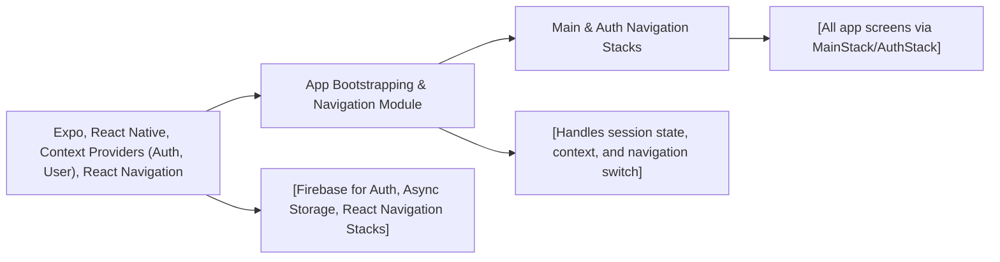

# App Bootstrapping & Navigation Module

## Overview
This module initializes the React Native app using Expo, providing the root structure for authentication handling, user context, and navigation flow. It dynamically switches between authentication and main app navigation stacks based on the user's authentication state, ensuring seamless session management and user-specific routing.

## Key Features
- **Context Providers Integration**: Wraps the app with authentication and user data providers to ensure app-wide access to user context and session state.
- **Dynamic Navigation**: Automatically switches between authentication screens and the main application stack depending on the authentication status.
- **Loading State Handling**: Displays a loading indicator during session or authentication checks for a smooth user experience.
- **Expo Compatibility**: Optimized as an entry point for Expo-managed workflows and compatible with major React Navigation features.

## System Errors
- **Authentication Context Not Available**: If the `AuthProvider` fails to initialize, navigation and session state may be unreliable. 
  - **Resolution**: Ensure `AuthProvider` wraps the entire app and that context is properly exported/imported.
- **User Context Loading Delays**: Slow fetching or initialization of user context may cause prolonged loading indicator visibility.
  - **Resolution**: Check network conditions and optimize context provider performance.
- **Navigation Errors**: Stack navigator misconfiguration or missing screens can break navigation flow.
  - **Resolution**: Ensure that `MainStack` and `AuthStack` are properly defined and passed as components to corresponding routes.

## Usage Examples

```jsx
import React from 'react';
import App from './App'; // This file acts as your main entry point

// No extra setup needed; simply run your Expo project:
// $ npm start
// Expo will automatically use App.js as the root, setting up authentication, user context, and navigation for you.
```

## System Integration


