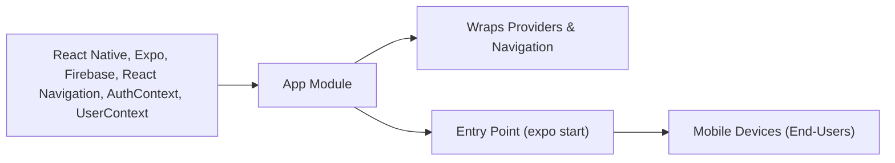

# App Module

## Overview
The **App module** is the root component of the Expo Firebase Boilerplate. It provides the entry point of the mobile application, sets up global providers for authentication and user state, and configures navigation routing. The module dynamically switches between the authentication and main application flows based on the user's authentication status.

## Key Features
- **Authentication State Management**: Wraps the application with an authentication provider to track and respond to the user's login state.
- **User Context Provisioning**: Supplies a global user context for application-wide access to user-specific data.
- **Dynamic Navigation Flow**: Automatically routes users to either authentication screens (`AuthStack`) or main application screens (`MainStack`) depending on their authenticated state.
- **Loading State Handling**: Displays a loading indicator while authentication state is being determined for a smooth user experience.

## System Errors
- **Authentication Loading Error**: If there is an issue determining the authentication state (e.g., communication with Firebase), the app may stay on the loading screen indefinitely.
  - **Resolution**: Verify network connectivity and configuration of Firebase credentials.
- **Navigation Mismatch**: If navigation routes are incorrectly configured, users may not be routed to appropriate stacks.
  - **Resolution**: Ensure that `AuthStack` and `MainStack` are exported correctly and navigation dependencies are up-to-date.

## Usage Examples
Below is an example of how the App module sets up providers and routing for the application:

```javascript
import React from 'react';
import { NavigationContainer } from '@react-navigation/native';
import { AuthProvider } from './context/AuthContext';
import { UserProvider } from './context/UserContext';

export default function App() {
  return (
    <AuthProvider>
      <UserProvider>
        <NavigationContainer>
          {/* AppNavigator handles screen switching based on authentication state */}
          <AppNavigator />
        </NavigationContainer>
      </UserProvider>
    </AuthProvider>
  );
}
```

## System Integration


