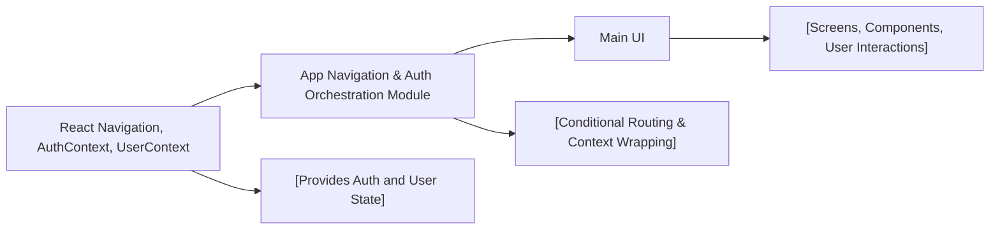

# App Navigation and Authentication Orchestration

## Overview
This module manages the entry point for the Expo Firebase application, orchestrating navigation based on user authentication status. It ensures users see the correct UI flow—either the authenticated main application or the authentication screens—by coordinating with authentication and user context providers.

## Key Features
- **Authentication State Routing**: Dynamically routes users to either the main app stack or the authentication stack based on their authentication status.
- **Loading Feedback**: Displays a loading indicator when authentication status is unresolved, enhancing user experience during asynchronous app startup.
- **Context Provisioning**: Wraps the application in authentication and user context providers, ensuring that authentication state and user data are accessible throughout the component tree.
- **Navigation Integration**: Utilizes React Navigation’s stack navigator for clear, modular screen transitions depending on user state.

## System Errors
- **Authentication Context Not Initialized**: If `useAuth()` fails to provide a context (e.g., missing `<AuthProvider>`), the app may crash.  
  _Resolution_: Ensure `AuthProvider` is placed high in the React tree enclosing all components relying on authentication.
- **Stuck on Loading Indicator**: If loading never completes, the app remains on the loading spinner.  
  _Resolution_: Check network connectivity and confirm Firebase or authentication backend is correctly configured and reachable.

## Usage Examples
Practical usage includes wrapping the root application with providers and initiating navigation based on auth state.

```javascript
import React from 'react';
import { NavigationContainer } from '@react-navigation/native';
import { AuthProvider, useAuth } from './context/AuthContext';
import { UserProvider } from './context/UserContext';

export default function App() {
  return (
    <AuthProvider>
      <UserProvider>
        <NavigationContainer>
          <AppNavigator />
        </NavigationContainer>
      </UserProvider>
    </AuthProvider>
  );
}

// AppNavigator handles whether to show the main application or auth flow
const AppNavigator = () => {
  const { currentUser, loading } = useAuth();

  if (loading) {
    return <SomeLoadingIndicator />;
  }

  return (
    <SomeStack.Navigator>
      {currentUser ? (
        <SomeStack.Screen name="Main" component={MainStack} />
      ) : (
        <SomeStack.Screen name="Auth" component={AuthStack} />
      )}
    </SomeStack.Navigator>
  );
};
```

## System Integration

