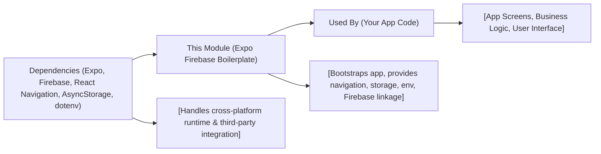

# Expo Firebase Boilerplate

## Overview
This module provides a ready-to-use mobile application template built with Expo and integrated with Firebase. It delivers essential project setup for React Native app development, fast-tracking common requirements such as navigation, secure environmental variables, and persistent data storage. The boilerplate aims to help developers expedite the setup process for apps that require authentication, cloud data, and smooth navigation across platforms (iOS, Android, and Web).

## Key Features
- **Expo Managed Workflow**: Abstracts and simplifies native code management, offering rapid development and cross-platform capabilities out of the box.
- **Firebase Integration**: Provides seamless connectivity to Firebase services (e.g., authentication, database, storage), enabling cloud-based features.
- **React Navigation**: Pre-configured stack and bottom tab navigation for robust multi-screen and nested navigation structures.
- **Persistent Storage**: Utilizes AsyncStorage to persist user and app data securely across sessions.
- **Environment Variable Management**: Includes dotenv support for secure and convenient configuration management.
- **Platform Support**: Runs smoothly on iOS, Android, and Web, leveraging Expo's unified project structure.

## System Errors
- **Firebase Initialization Error**: Occurs when Firebase is not properly configured or credentials are missing.
  - *Resolution*: Double-check your Firebase configuration files and environment variables. Ensure all required API keys are set.
- **Navigation Failure**: App does not correctly navigate between screens due to misconfigured routes.
  - *Resolution*: Review the navigation stack setup and ensure all screens are registered with the navigator.
- **AsyncStorage Access Error**: Failure when reading/writing data leads to data loss or unexpected app behavior.
  - *Resolution*: Confirm AsyncStorage is installed and linked, and check for permission issues or quota limitations.
- **Missing Environment Variables**: App fails to load configuration values, causing build or runtime errors.
  - *Resolution*: Create a `.env` file with all required variables, and ensure they are correctly referenced in the app.

## Usage Examples

```js
// Start the development server
// Terminal
npm start

// Access Firebase services
import { initializeApp } from 'firebase/app';
import { getAuth } from 'firebase/auth';
import { firebaseConfig } from './config';

const app = initializeApp(firebaseConfig);
const auth = getAuth(app);

// Use React Navigation
import { NavigationContainer } from '@react-navigation/native';
import { createBottomTabNavigator } from '@react-navigation/bottom-tabs';

const Tab = createBottomTabNavigator();

export default function App() {
  return (
    <NavigationContainer>
      <Tab.Navigator>
        {/* Register screens here */}
      </Tab.Navigator>
    </NavigationContainer>
  );
}

// Access persistent storage
import AsyncStorage from '@react-native-async-storage/async-storage';

async function storeUserName(name) {
  await AsyncStorage.setItem('userName', name);
}

async function getUserName() {
  return await AsyncStorage.getItem('userName');
}
```

## System Integration


