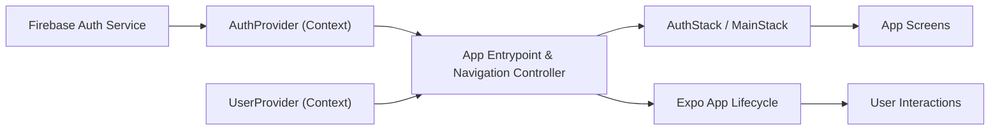

# App Entrypoint & Navigation Controller

## Overview
The App Entrypoint & Navigation Controller module initializes the application, manages global providers (authentication and user context), and orchestrates navigation flows based on authentication state. It acts as the core integration point for app lifecycle, authentication, user state, and screen routing.

## Key Features
- **Context Providers Integration**: Wraps the app in global `AuthProvider` and `UserProvider` to supply authentication and user state throughout the component tree.
- **Conditional Navigation**: Dynamically switches between authentication (`AuthStack`) and main application (`MainStack`) navigation stacks based on user login state.
- **Loading State Management**: Displays a loading spinner while authentication state is being determined, ensuring a smooth user experience on app launch.
- **Navigation Container Setup**: Integrates React Navigation to manage screen transitions and deep linking across the app.

## System Errors
- **Authentication Loading Timeout**: If the authentication state takes unusually long to resolve, users may see the loading indicator indefinitely.
  - **Resolution**: Check network connectivity and Firebase authentication setup.
- **Context Provider Errors**: Errors in `AuthProvider` or `UserProvider` may prevent the app from initializing.
  - **Resolution**: Validate that both providers are exported correctly and that required dependencies (e.g., Firebase SDK) are installed and configured.

## Usage Examples

```jsx
// Entry-point usage in App.js

import React from 'react';
import { NavigationContainer } from '@react-navigation/native';
import { AuthProvider } from './context/AuthContext';
import { UserProvider } from './context/UserContext';
import AppNavigator from './AppNavigator'; // Pseudocode import

export default function App() {
  return (
    <AuthProvider>
      <UserProvider>
        <NavigationContainer>
          <AppNavigator />
        </NavigationContainer>
      </UserProvider>
    </AuthProvider>
  );
}
```

```jsx
// AppNavigator detects and switches stacks based on authentication

import { createNativeStackNavigator } from '@react-navigation/native-stack';
import MainStack from './component/Navigation/MainStack';
import AuthStack from './component/Navigation/AuthStack';
import { useAuth } from './context/AuthContext';

const Stack = createNativeStackNavigator();

const AppNavigator = () => {
  const { currentUser, loading } = useAuth();

  if (loading) {
    return <LoadingIndicator />;
  }

  return (
    <Stack.Navigator>
      {currentUser ? (
        <Stack.Screen name="Main" component={MainStack} />
      ) : (
        <Stack.Screen name="Auth" component={AuthStack} />
      )}
    </Stack.Navigator>
  );
};
```

## System Integration


