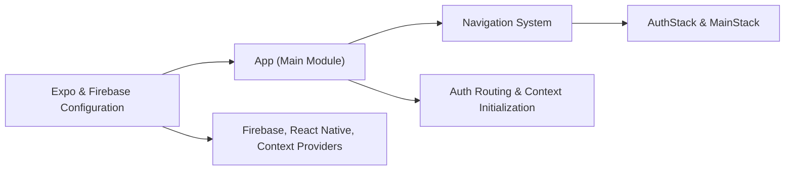

# Expo Firebase Boilerplate App

## Overview
This module serves as the entry point for an Expo-based React Native app, providing seamless integration between Firebase authentication and navigation logic. It establishes the core application structure, managing the flow between authenticated and unauthenticated app states using React Navigation, React Context, and Firebase as the authentication backend.

## Key Features
- **Authentication State Management**: Automatically determines if a user is authenticated via Firebase and toggles between the main app stack and authentication stack accordingly.
- **Context Providers**: Wraps the application with providers for shared authentication (`AuthProvider`) and user data (`UserProvider`), making state accessible throughout the component tree.
- **Dynamic Navigation Routing**: Uses conditional logic to route users to the appropriate navigation stack (`MainStack` for logged-in users, `AuthStack` for guests).
- **Loading State Handling**: Displays a central loading indicator while user authentication status is being determined, ensuring smooth UX during asynchronous checks.
- **Firebase Integration**: Utilizes Firebase services for backend authentication and user management.

## System Errors
- **Authentication Timeout/Error**: If Firebase authentication status check fails or hangs, the loading spinner may persist indefinitely.  
  *Resolution*: Ensure proper error handling in the `useAuth` context provider and validate Firebase configuration.
- **Missing Firebase Configuration**: If Firebase is not correctly initialized (such as missing environment variables), authentication and app logic will fail.  
  *Resolution*: Double-check environment setup and `firebase` initialization per project documentation.
- **Navigation Errors**: If navigation stacks (`MainStack`, `AuthStack`) are misconfigured or missing, navigation will error upon stack switch.  
  *Resolution*: Confirm that navigation components are imported and registered correctly within the project structure.

## Usage Examples

```javascript
// Run the app with Expo
expo start

// Example: Wrapping your app logic
import { AuthProvider } from './context/AuthContext';
import { UserProvider } from './context/UserContext';
import { NavigationContainer } from '@react-navigation/native';

export default function App() {
  return (
    <AuthProvider>
      <UserProvider>
        <NavigationContainer>
          {/* Navigation logic auto-switches based on authentication state */}
        </NavigationContainer>
      </UserProvider>
    </AuthProvider>
  );
}
```

## System Integration


