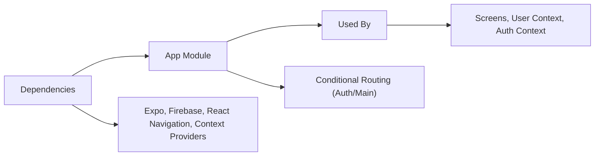

# App Module

## Overview
The App module is the entry point of the Expo Firebase boilerplate application. It manages global context providers, navigation logic, and conditional routing based on user authentication status. Its primary role is to orchestrate authentication state, user data provisioning, and navigation structure, ensuring the app displays correct screens whether the user is logged in or not.

## Key Features
- **Authentication State Management**: Dynamically switches between authentication and main application flows based on user's authentication status.
- **User Data Provisioning**: Wraps the app in a global user context provider for centralized user data access.
- **Navigation Structure**: Integrates React Navigation to enable stack-based screen transitions and support deep linking.
- **Loading Indicator**: Displays a loading spinner during authentication status checks, improving user experience during initialization.

## System Errors
- **Context Initialization Error**: If authentication or user context providers fail to initialize, navigation and state-dependent screens may not render.
  - **Resolution**: Ensure the context providers are correctly implemented and wrapped around the NavigationContainer.
- **Navigation Error**: Navigation stack misconfiguration may block users from reaching the correct screen based on authentication.
  - **Resolution**: Confirm `MainStack` and `AuthStack` are correctly defined and exported, and the conditional rendering logic is properly set up.
- **Firebase Connection Error**: Backend errors may prevent proper authentication or user data fetching.
  - **Resolution**: Verify Firebase initialization and credentials, and handle errors in AuthContext or UserContext.

## Usage Examples
Practical example showing how the module flows with context and navigation:

```javascript
import React from 'react';
import { AuthProvider } from './context/AuthContext';
import { UserProvider } from './context/UserContext';
import { NavigationContainer } from '@react-navigation/native';
import MainStack from './component/Navigation/MainStack';
import AuthStack from './component/Navigation/AuthStack';

export default function App() {
  return (
    <AuthProvider>
      <UserProvider>
        <NavigationContainer>
          {/* AppNavigator will conditionally show MainStack or AuthStack based on authentication */}
          <AppNavigator />
        </NavigationContainer>
      </UserProvider>
    </AuthProvider>
  );
}
```

## System Integration

