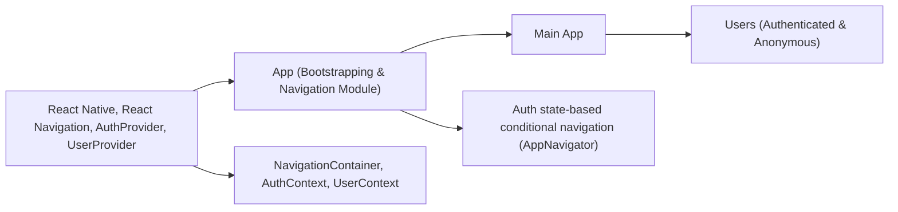

# Application Bootstrapping & Navigation Module

## Overview
This module serves as the entry point for the Expo Firebase Boilerplate application. It provides application-wide context providers, manages authentication state, and orchestrates the top-level navigation flow. By determining user authentication status, it conditionally routes users either to authenticated sections of the app or to authentication screens. It also ensures key contexts (auth/user) are available across the entire navigation tree.

## Key Features

- **Global Authentication Handling**: Automatically detects loading, signed-in, or signed-out states and routes accordingly.
- **Context Integration**: Wraps the main application in AuthProvider and UserProvider, ensuring that authentication and user data is accessible throughout the app.
- **Dynamic Navigation Stack**: Switches between main app navigation (MainStack) and authentication flow (AuthStack) based on user state.
- **Splash/Loading Screen**: Displays a loading indicator while user authentication state is being resolved.

## System Errors

- **Auth Loading Timeout**: If authentication state fails to resolve (e.g., network issues), the app may appear stuck on the loading indicator.
  - **Resolution**: Ensure the user's device has network connectivity and that authentication providers are correctly configured.

- **Navigation Tree Mismatch**: If MainStack or AuthStack are not properly exported or contain internal errors, navigation may fail to initialize.
  - **Resolution**: Confirm stack components are correctly implemented and exported.

## Usage Examples

```javascript
import App from './App';

// Register the main entry component with Expo
export default App;
```

- On app start, authentication/loading context is initialized:
  - If loading: shows spinner.
  - If authenticated: user is routed to main application features (MainStack).
  - If not authenticated: user is routed to login/register screens (AuthStack).

## System Integration


