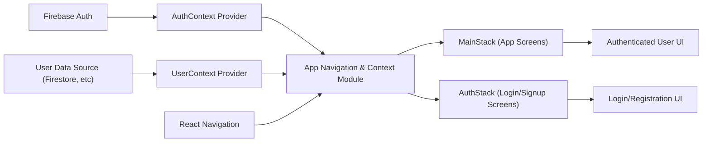

# App Navigation & Context Orchestration

## Overview
This module is the central entry point and navigation controller for the Expo Firebase boilerplate app. It manages high-level application routing based on user authentication state, initializes core providers (authentication and user profile context), and integrates the navigation stack. Its primary purpose is to ensure users are routed to the correct navigation flow (authenticated or unauthenticated), while maintaining global access to user and authentication states throughout the app.

## Key Features

- **Conditional Navigation**: Directs users either to the authentication screens (AuthStack) or the main application flow (MainStack) based on their authentication status.
- **Authentication State Management**: Integrates an authentication context provider, supplying current user and loading state across the app.
- **Global User Context**: Wraps the app with a user context provider, enabling access and management of user-specific data throughout all screens.
- **Expo Navigation Integration**: Sets up NavigationContainer as the root for all app navigation, compatible with React Navigation's stack and tab navigators.
- **Loading State Handling**: Displays a centered activity indicator when authentication state is still being determined, improving user experience during app initialization.

## System Errors

- **Authentication Context Not Available**: Occurs if the AuthProvider is not correctly initialized or its context isn't accessible.  
  _Resolution_: Always ensure `<AuthProvider>` wraps the application root before accessing authentication hooks or context.
- **Navigation Rendering Issues**: May arise if NavigationContainer is missing or if the stack navigators are not registered properly.  
  _Resolution_: Confirm correct nesting of `NavigationContainer` and ensure all stack components (AuthStack, MainStack) are properly exported.
- **Loading Spinner Not Disappearing**: If the authentication state never resolves (e.g., due to Firebase connection issue), app remains stuck in loading.  
  _Resolution_: Check Firebase setup and connectivity; ensure the auth context resolves both success and failure states.

## Usage Examples

```javascript
import React from 'react';
import { NavigationContainer } from '@react-navigation/native';
import { AuthProvider } from './context/AuthContext';
import { UserProvider } from './context/UserContext';
import AppNavigator from './AppNavigator'; // hypothetical extraction for modular use

export default function App() {
  return (
    <AuthProvider>
      <UserProvider>
        <NavigationContainer>
          <AppNavigator />
        </NavigationContainer>
      </UserProvider>
    </AuthProvider>
  );
}

// AppNavigator routes based on auth state:
// - <MainStack/> if user is authenticated
// - <AuthStack/> if user is unauthenticated
```

## System Integration


