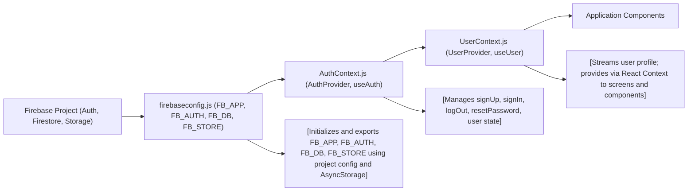

# Firebase Integration Module

## Overview
This module centralizes the integration of Firebase services (Authentication, Firestore Database, and Storage) for the Expo React Native application. It provides app-wide context providers to manage user authentication and user profile data, streamlining how different parts of the system access Firebase resources and user state.

## Key Features

- **Firebase Core Initialization**: Initializes the main Firebase app instance and connects all required services (Authentication, Firestore, Storage) with React Native persistence.
- **Authentication Context**: Supplies a context API for consuming authentication state (login, logout, signup, password reset) throughout the app via `AuthContext`.
- **User Profile Management**: Provides live user profile data by listening to Firestore user document changes through `UserContext`.
- **Reusable Provider Pattern**: Exports React providers that inject Firebase-backed state and APIs directly into the React component tree.
- **Cross-Module Consistency**: Standardizes interactions with Firebase, ensuring all subsystems use shared, consistent authentication and data access patterns.

## System Errors

- **Invalid Firebase Configuration**:  
  _Description_: Missing or invalid config values in environment variables (e.g., API keys).  
  _Resolution_: Ensure all Firebase environment variables are set and correct before build and deploy.

- **Authentication Failures**:  
  _Description_: Errors such as invalid credentials, user not found, or email already in use during sign-in/up.  
  _Resolution_: Handle errors from `signIn`/`signUp` methods in UI; display user-friendly messages.

- **Firestore User Document Missing**:  
  _Description_: No matching Firestore "users" document for authenticated user (`No such user!`).  
  _Resolution_: Ensure user profile documents are created upon signup or handle missing document in downstream logic.

- **AsyncStorage/Persistence Issues**:  
  _Description_: Problems saving auth/session info on device.  
  _Resolution_: Check device storage permissions and the configuration of `@react-native-async-storage/async-storage`.

## Usage Examples

```javascript
// 1. Initialize providers in App.js root
import { AuthProvider } from './context/AuthContext';
import { UserProvider } from './context/UserContext';

export default function App() {
  return (
    <AuthProvider>
      <UserProvider>
        <MyAppRoutes />
      </UserProvider>
    </AuthProvider>
  );
}

// 2. Using authentication state and actions
import { useAuth } from './context/AuthContext';

function LoginScreen() {
  const { signIn, loading, currentUser } = useAuth();

  const handleLogin = async (email, password) => {
    try {
      await signIn(email, password);
      // Handle success (navigate, etc.)
    } catch (e) {
      // Handle errors (show error message)
    }
  };
  // ...
}

// 3. Accessing user profile from Firestore
import { useUser } from './context/UserContext';

function ProfileScreen() {
  const { profile } = useUser();

  return (
    <View>
      <Text>Welcome, {profile.name || 'User'}!</Text>
      {/* More profile fields */}
    </View>
  );
}
```

## System Integration


