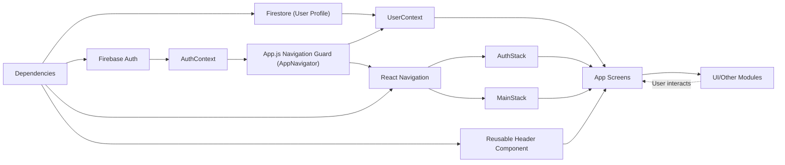

# Expo-Firebase Boilerplate App Overview

## Overview
This module is a React Native application boilerplate that integrates user authentication and profile management using Firebase services. It provides a ready-to-use code structure for apps needing user registration, sign-in, and authenticated navigation flows. The app separates authentication and main user workflows via navigational stacks and leverages context providers for seamless state management. 

## Key Features

- **Authentication Flow Management**:  
  Separates authentication (sign up, sign in, password reset) from the main app via dedicated navigation stacks (AuthStack and MainStack).

- **Persistent User Sessions**:  
  Utilizes Firebase Auth and React Context to persist and monitor user sessions and provide immediate navigation to the correct flow (authenticated or not).

- **User Profile Data Context**:  
  Uses Firestore and a dedicated UserContext to read and provide up-to-date user profile data (e.g., first/last name) throughout the app for authenticated users.

- **Bottom Tab Navigation**:  
  Implements a bottom tab bar (MainStack) for post-auth screens: Home, Browse, Profile, offering a clear, mobile-friendly navigation pattern.

- **Reusable Components**:  
  Includes ready-to-use UI parts such as a custom header and various screen templates, making customization simple.

## System Errors

- **Authentication Errors**:  
  Errors during sign-in or sign-up (e.g., invalid credentials, email already used, weak password) are surfaced to users with actionable feedback.
  - **Error Type**: auth/invalid-credential, auth/email-already-in-use, auth/weak-password  
    **Resolution**: User must check entered credentials or choose a stronger password; error messages are shown inline on the relevant screen.

- **Firestore Profile Loading Error**:  
  If profile data cannot be fetched from Firestore, the app defaults to displaying a minimal user experience and logs the error for diagnostics.
  - **Error Type**: Firestore not responding or user document missing  
    **Resolution**: Ensure proper Firebase configuration and that the authenticated user exists in the Firestore "users" collection.

- **Navigation Errors**:  
  Any error during navigation (e.g., routes not found after sign-in/out) typically results from misconfiguration. 
  - **Resolution**: Ensure stack and tab routes names match actual screen components; check stack initial routes if errors persist.

## Usage Examples

```javascript
// Sign up a new user and create a Firestore profile
const { signUp } = useAuth();
signUp(email, password)
  .then(userCredential => {
    const userDocRef = doc(FB_DB, 'users', userCredential.user.uid);
    return setDoc(userDocRef, { FirstName: firstName, LastName: lastName });
  });

// Sign in an existing user
const { signIn } = useAuth();
signIn(email, password).then(() => {
  // Navigate to MainStack automatically on success
});

// Get the current user's profile anywhere in the app
const { profile } = useUser();
console.log(profile.FirstName);

// Log out and return to Auth flow
const { logOut } = useAuth();
logOut();
```

## System Integration


