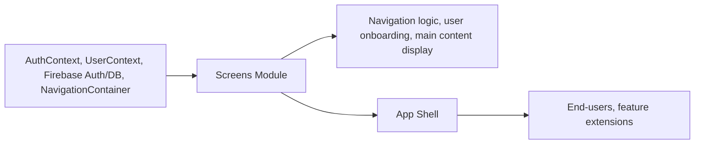

# Screens Module

## Overview
The **Screens Module** contains all main user-facing screens and flows for the Expo-Firebase Boilerplate application. This module provides the foundational navigation structure, manages user authentication routes, and surfaces feature screens including Home, Profile, Browse, Sign In, and Sign Up. Its purpose is to organize predictable navigation and user journeys across the app, making the application modular and extensible.

## Key Features
- **Authentication Workflow**: Screens for user sign-in (`SignInScreen`) and sign-up (`SignUpScreen`), including validation and integration with backend authentication. Handles routing between authentication and main app flows.
- **User Home Screen**: Landing page (`HomeScreen`) after authentication, displaying a personalized welcome message from user profile data and providing a sign-out mechanism.
- **Profile Management**: Basic user profile viewing (`ProfileScreen`), providing a template for expansion with account or settings features.
- **Content Browsing**: Dedicated browsing area (`BrowseScreen`) for user interaction beyond the home dashboard.
- **Onboarding & Navigation**: Entry (`FirstScreen`) for new or logged-out users, with explicit options for registration and sign-in, ensuring clear user journey initiation.
- **Reusable App Header**: Flexible `Header` component for consistent UI branding and potential navigation controls across screens.

## System Errors
- **Authentication Errors**: 
  - **Invalid Credential**: Displays user-friendly error when sign-in credentials are incorrect.  
    *Resolution*: End-user should check their email or password accuracy.
  - **Email Already in Use**: Prevents user registration with a previously registered email.
    *Resolution*: User must use a different email address or attempt password recovery.
  - **Invalid Email / Weak Password**: Input validation ensures only properly formatted and strong passwords are accepted.
    *Resolution*: User must correct their input as per displayed messages.
- **Navigation Errors**:
  - **Route Reset Failures**: Edge case if navigation stack reset fails during sign-in/out.
    *Resolution*: Relaunching the application generally resolves these, as stack will re-initialize.
- **General UI Validation**:
  - Missing Required Fields (e.g., empty email or password): Screen-level error messages advise users to complete forms.
    *Resolution*: User must fill in all required fields before submission.

## Usage Examples

```jsx
// Navigating between authentication and main screens based on user state
function App() {
  return (
    <AuthProvider>
      <UserProvider>
        <NavigationContainer>
          <AppNavigator />
        </NavigationContainer>
      </UserProvider>
    </AuthProvider>
  );
}

// In SignUpScreen: Handling user registration and storing profile data
<TouchableOpacity onPress={SignUpUser} style={styles.button}>
  <Text>S'inscrire</Text>
</TouchableOpacity>

// In SignInScreen: Handling sign-in and navigation on success
<TouchableOpacity onPress={SignInUser} style={styles.button}>
  <Text>Se connecter</Text>
</TouchableOpacity>

// Navigating to Profile from HomeScreen (example)
<Button title="Profil" onPress={() => navigation.navigate('Profile')} />
```

## System Integration


