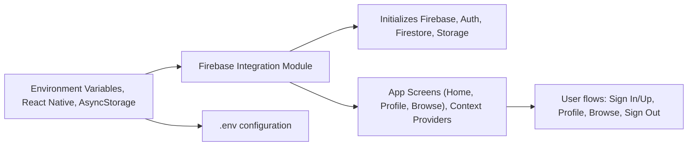

# API & Integration Overview

## Overview
This module forms the integration hub for Firebase services in the Expo-Firebase Boilerplate. It provides initialized API instances for authentication, Firestore database, and file storage, enabling screens and components across the React Native app to securely access backend features. The module ensures persistent authentication and smooth user data management, powering Home, Profile, and Browse screens.

## Key Features

- **Firebase Initialization**: Sets up and configures Firebase app connectivity, sourcing environment variables for secure and flexible deployment.
- **Authentication API (FB_AUTH)**: Enables user authentication features, session management, and supports persistent login via React Native's AsyncStorage.
- **Firestore Database API (FB_DB)**: Provides a public interface for reading and writing application data in a scalable, real-time NoSQL database.
- **Storage API (FB_STORE)**: Facilitates uploading, retrieving, and managing media assets and user files in cloud storage.
- **Pre-integrated Context Usage**: Supports plug-and-play use by application screens (e.g., HomeScreen) via context and hooks for easy user and profile management.

## System Errors

- **Missing Environment Variables**:  
  *Description*: If any required Firebase field (e.g., API key, project ID) is missing from environment variables, initialization may fail silently or with a configuration error.  
  *Resolution*: Verify all necessary credentials are present in your environment configuration and properly referenced.

- **Authentication Issues**:  
  *Description*: Sign in, sign out, or persistence failures due to invalid credentials or network issues.  
  *Resolution*: Ensure network connectivity, correct credential input, and properly initialized auth persistence via AsyncStorage.

- **Firestore/Storage Access Errors**:  
  *Description*: Attempts to read/write data or files may produce permission or connectivity errors.  
  *Resolution*: Check Firebase Firestore/Storage security rules and confirm user authentication state.

## Usage Examples

```javascript
// Import Firebase APIs in a screen or component
import { FB_AUTH, FB_DB, FB_STORE } from '../firebaseconfig';
import { signOut } from 'firebase/auth';

// Example: Signing out a user and navigating on success
signOut(FB_AUTH)
  .then(() => navigation.reset({ index: 0, routes: [{ name: 'Auth' }] }))
  .catch(error => console.error('Logout error:', error));

// Example: Getting a Firestore collection
import { collection, getDocs } from 'firebase/firestore';
const querySnapshot = await getDocs(collection(FB_DB, "users"));

// Example: Uploading a file to Firebase Storage
// import { ref, uploadBytes } from "firebase/storage";
// const storageRef = ref(FB_STORE, 'some-child');
// uploadBytes(storageRef, fileBlob).then(snapshot => console.log('Uploaded'));
```

## System Integration


