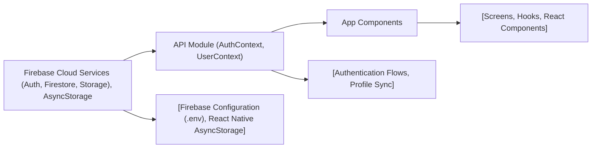

# API Overview

## Overview
This module provides a feature-centric abstraction for integrating Firebase authentication and user profile management into a React Native Expo application. It establishes authentication workflows (sign up, sign in, sign out, password reset) and enables seamless access to Firestore-based user profiles. The system leverages React Contexts for global state management and Firebase client SDKs for cloud service integration.

## Key Features
- **Firebase Service Initialization**: Secure bootstrapping and configuration of Firebase App, Auth, Firestore, and Storage, streamlined for React Native via persistent storage.
- **AuthContext**: Exposes high-level authentication APIs (`signUp`, `signIn`, `logOut`, `resetPassword`) and provides real-time authentication state to the application.
- **UserContext**: Automatically loads and updates the authenticated user's Firestore profile document, making profile data globally available within the app.

## System Errors
- **Authentication Failure**: Occurs when sign-in/sign-up fails (e.g., invalid credentials, network issues).  
  _Resolution_: Check credentials, ensure device network connectivity, and review Firebase project configuration.
- **User Profile Not Found**: Triggered when a Firestore user document does not exist for the signed-in user.  
  _Resolution_: Ensure user profiles are written to Firestore as part of the onboarding flow.
- **Persistence Issues**: Arises if AsyncStorage fails to operate or initialize with Firebase Auth.  
  _Resolution_: Confirm `@react-native-async-storage/async-storage` is installed and functioning.

## Usage Examples

```javascript
// Wrap your app with AuthProvider and UserProvider in App.js
import { AuthProvider } from './context/AuthContext';
import { UserProvider } from './context/UserContext';

export default function App() {
  return (
    <AuthProvider>
      <UserProvider>
        {/* ...your app components */}
      </UserProvider>
    </AuthProvider>
  );
}

// Use authentication features in components
import { useAuth } from './context/AuthContext';

function LoginScreen() {
  const { signIn, resetPassword, loading, currentUser } = useAuth();

  const handleLogin = async () => {
    try {
      await signIn(email, password);
    } catch (e) {
      // handle error
    }
  };
}

// Access current user's profile anywhere in the app
import { useUser } from './context/UserContext';

function ProfileScreen() {
  const { profile } = useUser();

  return <Text>{profile.displayName}</Text>;
}
```

## System Integration


