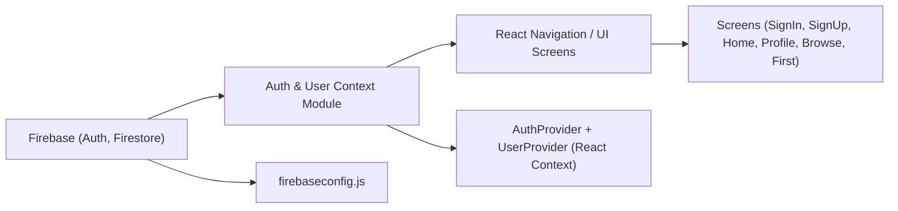

# Expo Firebase Authentication & User Context Overview

## Overview

This module provides seamless user authentication and authenticated user data management for the Expo React Native application using Firebase as the backend service. It abstracts authentication flows (sign-up, sign-in, sign-out, password reset) and centralizes access to authenticated user profiles via React Context providers. The module ensures users can securely access app features and their personalized data, and routes them appropriately in the navigation stack according to their auth status.

## Key Features

- **Firebase Authentication Initialization**: Configures Firebase Authentication for Expo using AsyncStorage to persist login states on devices.
- **Authentication Context (`AuthContext`)**: Supplies the entire app with authentication state (`currentUser`) and exposes API methods for sign-up, sign-in, sign-out, and password reset.
- **User Context (`UserContext`)**: Provides real-time access to authenticated user's profile data stored in Firestore, available throughout the app.
- **Role-based Navigation Routing**: Monitors authentication state and automatically switches between public (AuthStack) and protected (MainStack) navigation flows.
- **Registration Workflow Integration**: On user registration, not only creates the Firebase Auth account but also stores the user’s profile in Firestore, making it available for UserContext.
- **Centralized Error Handling**: Aggregates authentication-related errors (invalid input, wrong credentials, duplicate accounts, weak passwords) to give actionable feedback to users.

## System Errors

- **auth/email-already-in-use**: The email address is already registered.  
  _Resolution_: Prompt user to use a different email or navigate to password reset.
- **auth/invalid-email**: Entered email does not match email format.  
  _Resolution_: Instruct user to enter a valid email address.
- **auth/weak-password**: The password is too short (usually less than 6 characters).  
  _Resolution_: Validate and ask user for a longer password.
- **auth/invalid-credential**: Email or password is incorrect at sign-in.  
  _Resolution_: Alert user and allow to retry, show password reset option.
- **User profile not found in Firestore**: Logged in via Auth but missing Firestore profile.  
  _Resolution_: Show fallback UI or prompt user support, as this should not occur in normal flow.

## Usage Examples

```js
// Access current user and auth actions from anywhere in the app
import { useAuth } from './context/AuthContext';

const { currentUser, signIn, signUp, logOut, resetPassword } = useAuth();

signIn(email, password)
  .then(() => {
    // Navigate to MainStack on success
  })
  .catch((err) => {
    // Handle errors like 'auth/invalid-credential'
  });

// Register new user and save profile to Firestore
signUp(email, password)
  .then((userCredential) => {
    // Save profile using Firestore API
    // e.g., setDoc(doc(FB_DB, 'users', userCredential.user.uid), { ...profileData });
  });

// Accessing user profile data everywhere
import { useUser } from './context/UserContext';
const { profile } = useUser();
console.log(profile.FirstName, profile.LastName);
```

## System Integration



- **dependencies**: Relies on Firebase services initialized in `firebaseconfig.js`
- **thisModule**: Combines `AuthContext.js` and `UserContext.js` to orchestrate authentication and user state.
- **usedBy**: Main app entry (`App.js`), navigation layers, and all feature screens consume auth/user context.
- **process**: All children wrapped in context providers receive up-to-date `currentUser` and profile info.
- **consumers**: Feature screens use the contexts to enable/disable UI, gate navigation, and customize user experiences.

---

**When to use this module:**  
- Any Expo project requiring user sign-up/sign-in flows, protected navigation, and persistent user profile data.  
- Use it to abstract away complex Firebase-specific details and standardize identity workflows across your app.