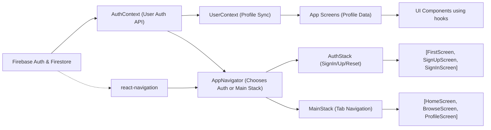

# API Overview

## Overview
The API layer in this Expo + Firebase boilerplate manages user authentication, user profile synchronization, and app navigation states. It coordinates access to Firebase authentication, listens for user profile changes in Firestore, and orchestrates navigation flows between authentication screens and main app features.

## Key Features
- **User Authentication**: Centralized access to Firebase Auth APIs for sign in, sign up, logout, and password reset, via the AuthContext provider.
- **User Profile Sync**: Transparent synchronization of the current user's profile document from Firestore to React context using the UserContext provider.
- **Conditional Navigation**: Automatic switching between authentication flow (AuthStack) and main app flow (MainStack) based on user auth state.
- **Nested Navigation Structure**: Support for both stack and tab-based navigation, isolating authentication, home, browse, and profile screens for modular UI development.

## System Errors
- **Authentication Errors**: Errors from Firebase Auth (e.g., incorrect credentials, duplicate accounts).
  - **Resolution**: Check error messages from `signIn`, `signUp`, or `resetPassword` and surface them via UI for user correction.
- **User Profile Load Failure**: Failure to fetch or listen to Firestore user profile (e.g., network issues, document missing).
  - **Resolution**: The app logs "No such user!" in debug mode—handle gracefully by prompting users to retry or check their network connection.
- **Navigation Misconfiguration**: Misnamed initial routes or missing screens in navigators may cause blank screens or navigation errors.
  - **Resolution**: Ensure all screens are registered and initialRouteName matches actual screen names.

## Usage Examples

```jsx
// Access AuthContext: Sign in a user
import { useAuth } from './context/AuthContext';

function LoginComponent() {
  const { signIn, loading, currentUser } = useAuth();

  const handleLogin = async () => {
    try {
      await signIn('user@example.com', 'securePassword');
      // User now navigated to MainStack if authenticated
    } catch (e) {
      // Show error to user
    }
  };

  // Render login form...
}

// Access current user's profile information
import { useUser } from './context/UserContext';

function ProfileComponent() {
  const { profile } = useUser();

  return (
    <Text>Welcome {profile.displayName}</Text>
  );
}

// Navigation is automatic; the app switches between AuthStack and MainStack:
import { NavigationContainer } from '@react-navigation/native';
// Just wrap your app with providers and NavigationContainer as in App.js
```

## System Integration


