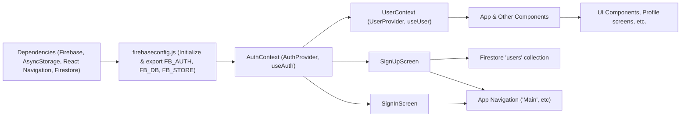

# Authentication and User Management Module

## Overview
This module provides authentication and user profile management for the Expo-Firebase Boilerplate. It integrates Firebase Authentication and Firestore to enable user sign-in, sign-up, sign-out, password reset, and profile retrieval within a React Native application. The module uses React contexts (`AuthContext`, `UserContext`) to supply authentication state and user information throughout the app. UI components (SignInScreen, SignUpScreen) provide end-user interactions.

## Key Features

- **Firebase Initialization**: Centralizes and exposes configured Firebase services (Auth, Firestore, Storage) for use across the application.
- **User Authentication Context (`AuthContext`)**: Provides React context with public functions for:
  - Sign up (with email/password)
  - Sign in (with email/password)
  - Password reset
  - Log out
  - Access to current authentication state and loading state
- **User Profile Context (`UserContext`)**: Supplies a context to retrieve and update the current signed-in user's profile from Firestore, automatically syncing on authentication changes.
- **Sign-In Flow (`SignInScreen`)**: Presents UI for user email/password login, with error handling for credential issues, and navigation on success.
- **Sign-Up Flow (`SignUpScreen`)**: Presents UI for user registration, creates Firebase Auth user, then stores profile info in Firestore, with granular error handling and navigation integration.

## System Errors

- **auth/invalid-credential**: Thrown during sign-in if provided email or password is incorrect.
  - *Resolution*: User is notified to check credentials; error is shown under password input.
- **auth/email-already-in-use**: Thrown during sign-up if the email is already registered.
  - *Resolution*: User is notified; error message shown under email field.
- **auth/invalid-email**: Triggered if email is in an incorrect format during sign-up.
  - *Resolution*: User is prompted for a valid email address.
- **auth/weak-password**: Sign-up fails if password does not meet minimum strength (typically 6 characters).
  - *Resolution*: User must choose a stronger password; error message shown.
- **Empty Field Validation**: UI prevents submission with empty fields, and highlights missing values with error messages before making Firebase calls.
- **Firestore Write Errors**: Failures when storing user profile after sign-up.
  - *Resolution*: General error message logged for diagnostics; no user feedback unless specifically implemented.

## Usage Examples

```jsx
// 1. Wrap your app with AuthProvider and UserProvider
import { AuthProvider } from './context/AuthContext';
import { UserProvider } from './context/UserContext';

export default function App() {
  return (
    <AuthProvider>
      <UserProvider>
        {/* ...rest of your app... */}
      </UserProvider>
    </AuthProvider>
  );
}

// 2. Use authentication functions in your screens
import { useAuth } from '../context/AuthContext';

// Sign in a user
const { signIn } = useAuth();
signIn(email, password)
  .then(user => /* navigate to main app */)
  .catch(error => /* handle errors - e.g., invalid credentials */);

// Sign up a user, then store profile info
const { signUp } = useAuth();
signUp(email, password)
  .then((userCredential) => {
    // Store extra profile data in Firestore (`users` collection, doc by uid)
  });

// 3. Access current user profile anywhere in the tree
import { useUser } from '../context/UserContext';
const { profile } = useUser();
console.log(profile.FirstName, profile.LastName);
```

## System Integration


