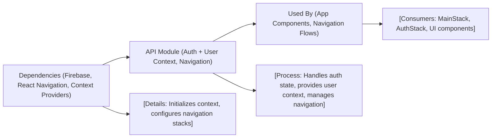

# API Overview

## Overview
The API module provides a centralized interface for managing authentication, user sessions, and navigation flows within the Expo-Firebase boilerplate application. It connects user context, authentication state, and main navigation stacks to enable seamless transitions between authenticated and unauthenticated experiences. This module helps other services and components access user data, determine authentication status, and handle navigation logic.

## Key Features
- **Authentication State Management**: Monitors, updates, and exposes the current user’s authentication status throughout the app.
- **User Context Provisioning**: Supplies user-related data to app components, enabling personalized features and stateful UI.
- **Navigation Flow Control**: Directs users to either authenticated (MainStack) or unauthenticated (AuthStack) flows depending on their session state.
- **Loading/UI State Coordination**: Communicates loading states, such as awaiting authentication checks, ensuring appropriate visual feedback.

## System Errors
- **Authentication Unavailable**: Occurs when authentication providers fail to respond or initialize.  
  *Resolution*: Ensure network connectivity and correct API credentials.

- **User Context Error**: Triggered when user data cannot be loaded or is missing.  
  *Resolution*: Check user provider integration and validate backend user data retrieval.

- **Navigation Initialization Failure**: Results from issues in navigation container setup or stack configuration.  
  *Resolution*: Verify navigation component imports and confirm correct stack structure.

## Usage Examples

```javascript
import { useAuth } from './context/AuthContext';

function AppContent() {
  const { currentUser } = useAuth();
  // Use currentUser to display personalized information
  return currentUser ? <MainApp /> : <LoginScreen />;
}

// Wrapping the app with providers
export default function App() {
  return (
    <AuthProvider>
      <UserProvider>
        <NavigationContainer>
          <AppNavigator />
        </NavigationContainer>
      </UserProvider>
    </AuthProvider>
  );
}
```

## System Integration


