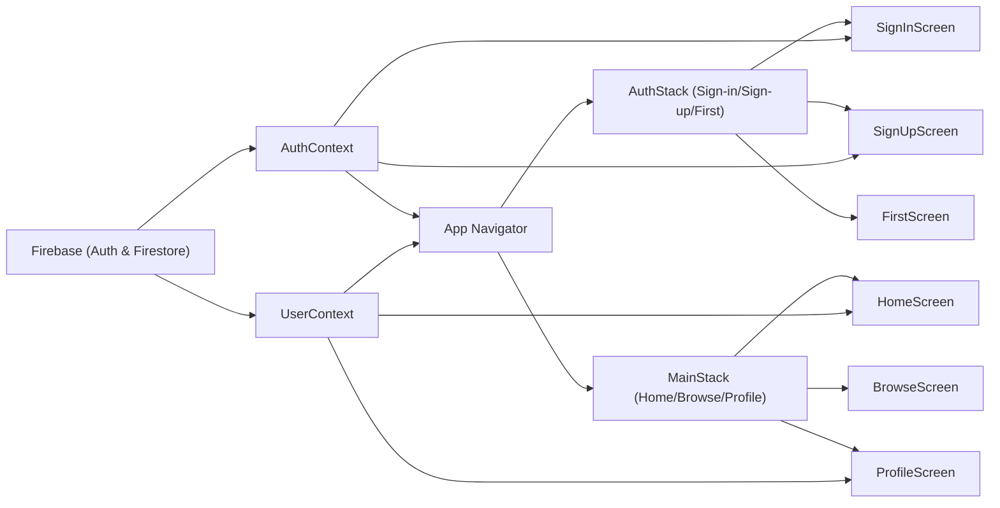

# App Architecture

## Overview
This module orchestrates the main application architecture, managing user authentication state, user profile data, and navigation across public (authentication) and protected (main app) screens. It acts as the root entry point, providing authentication context, user context, and dynamic navigation rendering based on the user's signed-in status.

## Key Features
- **Authentication State Management**: Detects user authentication state (signed in/out), provides it across the app, and controls access to protected features.
- **User Context Propagation**: Supplies user profile and related data fetched from Firestore to all nested components.
- **Dynamic Navigation Flow**: Switches between authentication and main app stacks depending on whether a user is authenticated.
- **Public and Protected Screen Routing**: Exposes distinct navigation flows for authentication (sign in, sign up) and main (home, browse, profile) screens.
- **Context-Driven UI Re-rendering**: Automatically re-renders screens and navigators in response to changes in authentication or user context.

## System Errors

- **Auth Errors (sign-in/up)**:  
  - *auth/invalid-credential*: Email or password is incorrect.  
    *Resolution*: Check credentials; show error to user.
  - *auth/email-already-in-use*: Email is already registered.  
    *Resolution*: Prompt user to use a different email or sign in.
  - *auth/invalid-email*: Email format is invalid.  
    *Resolution*: Ask user to re-enter a valid email.
  - *auth/weak-password*: Password too short or insecure.  
    *Resolution*: Ask user to choose a stronger password.

- **User Data Errors**:  
  - *No such user!*: Firestore user document does not exist.  
    *Resolution*: Ensure profile is created after sign up; handle empty state gracefully.
  - *Data retrieval error*: Issues accessing Firestore.  
    *Resolution*: Check network, Firestore rules, and authentication.

- **Navigation Logic Errors**:  
  - *Stuck loading*: If `loading` state doesn't resolve, screen stuck on spinner.  
    *Resolution*: Ensure `onAuthStateChanged` triggers as expected and there are no unhandled errors in authentication providers.

## Usage Examples

```jsx
// App.js (how contexts and navigation are composed)
export default function App() {
  return (
    <AuthProvider>
      <UserProvider>
        <NavigationContainer>
          <AppNavigator />
        </NavigationContainer>
      </UserProvider>
    </AuthProvider>
  );
}

// Accessing auth state in a component (e.g., screens/HomeScreen.js)
import { useAuth } from '../context/AuthContext';
const { currentUser, logOut } = useAuth();

// Displaying user profile (via context) on HomeScreen
import { useUser } from '../context/UserContext';
const { profile } = useUser();
<Text>Bienvenue {profile.FirstName} {profile.LastName}</Text>

// Main navigation switching
const { currentUser, loading } = useAuth();
if (currentUser) {
  // Show MainStack (protected app)
} else {
  // Show AuthStack (login/register)
}
```

## System Integration


