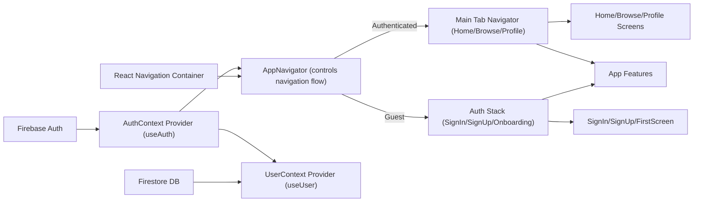

# Navigation and Context Architecture

## Overview
This module provides the architectural foundation for user authentication, user state management, and navigation flow in the app. It controls how users move through authentication screens and the main app, while maintaining the current authentication status and user profile data. By combining React Navigation patterns with Firebase-based authentication and user context, it enables seamless transitions and consistent user state across the application.

## Key Features

- **Authentication State Management**: 
  Manages sign-in, sign-up, sign-out, and password reset workflows using Firebase Auth, exposing the current user and loading state throughout the app.

- **User Profile Context**: 
  Listens for changes to the authenticated user's profile in Firestore, making profile data available to the application in real-time.

- **Authentication Stack Navigation**: 
  Provides a stack navigator for guest users, showing onboarding, sign-in, and sign-up screens based on authentication state.

- **Main App Tab Navigation**: 
  Offers a bottom tab navigator for signed-in users to access primary app sections: Home, Browse, and Profile screens.

- **Conditional Navigation Flow**: 
  Automatically determines which navigation stack to display based on whether a user is authenticated, ensuring correct user experience at all times.

## System Errors

- **Invalid Credentials / Auth Errors**: 
  Occur during sign-up/sign-in (e.g., wrong password, email in use). Resolution: Handle with user feedback, validate credentials before submission.

- **Network / Firebase Service Issues**: 
  Errors in Firebase auth calls or Firestore access can interrupt sign-in or profile loading. Resolution: Display a generic error message and allow retry.

- **User Profile Not Found**: 
  If the Firestore user document does not exist for an authenticated user. Resolution: Log warning, optionally prompt onboarding or contact support.

- **Loading States**: 
  The app may be stuck in a loading state if network is slow or Firebase initialization takes time. Resolution: Ensure loading indicators are shown and add timeout or graceful degradation.

## Usage Examples

```jsx
// In your App.js (already handled by boilerplate)
import React from 'react';
import App from './App';

export default function EntryPoint() {
  return <App />;
}

// Accessing authentication context in a component
import { useAuth } from './context/AuthContext';
function SomeComponent() {
  const { currentUser, signIn, signOut } = useAuth();

  // Trigger sign-in
  const handleLogin = () => signIn('email@example.com', 'password');

  return (
    <View>
      {currentUser ? <Button title="Sign Out" onPress={signOut} /> : <Button title="Sign In" onPress={handleLogin} />}
    </View>
  );
}

// Accessing user profile context
import { useUser } from './context/UserContext';
function ProfileSummary() {
  const { profile } = useUser();
  return <Text>{profile.displayName}</Text>;
}
```

## System Integration



**Legend:**
- **Firebase Auth/Firestore**: Provides authentication and user data services.
- **Context Providers**: Make authentication state and user profile available to all components.
- **Navigation Container/AppNavigator**: Orchestrates the screen flow based on user context.
- **MainStack/AuthStack**: Present appropriate screens depending on the user's authentication status.
- **Consumers**: Any UI component or feature needing user state or navigation capabilities.