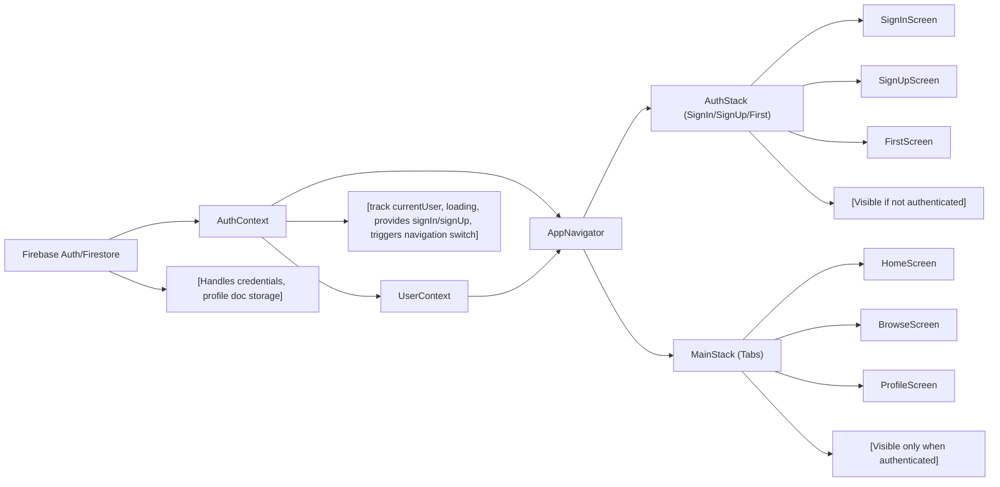

# Application Navigation and Authentication Architecture

## Overview

This module defines the overall navigation and authentication architecture for the Expo Firebase Boilerplate application. It coordinates user authentication, route guarding, and navigation stack control to ensure that users have the correct access and experience as they move through the app.

This module is responsible for:
- Handling user authentication state (sign in, sign up, sign out)
- Providing global user profile context
- Switching between authentication screens and main application screens based on user status
- Structuring the app's navigation using stack and tab navigators

## Key Features

- **Authentication Workflow**: Manages sign-in, sign-up, and sign-out processes, and controls access to app screens based on authentication status.
- **User Profile Context**: Provides authenticated user profile data throughout the app.
- **Navigation Stack Switching**: Dynamically switches between unauthenticated (AuthStack) and authenticated (MainStack) navigation flows.
- **Tab-Based Main Navigation**: For authenticated users, offers a tab bar interface with Home, Browse, and Profile screens.
- **Error Feedback and Validation**: Provides users with input validation and error feedback during authentication actions.

## System Errors

- **Authentication Errors**: 
  - **auth/invalid-credential**: Occurs on sign-in when credentials are wrong. Resolution: Inform the user that email or password is incorrect.
  - **auth/email-already-in-use**: Occurs on sign-up when the email is already registered. Resolution: Prompt the user to use another email or sign in.
  - **auth/invalid-email**: Invalid email format during sign-up or sign-in. Resolution: Prompt user to provide a valid email address.
  - **auth/weak-password**: Password is too short on sign-up. Resolution: Require a stronger password (minimum 6 characters).
- **Profile Loading Errors**: 
  - **No such user!**: Occurs if user profile data is missing in Firestore after sign-in. Resolution: Prompt user to contact support if this persists.
- **Sign-Out Errors**:
  - **Firebase signOut failure**: If sign out fails (network or internal), error is logged to console. Resolution: Advise user to retry or check connection.

## Usage Examples

```jsx
// App.js: Application entry point, sets up providers and navigation

export default function App() {
  return (
    <AuthProvider>
      <UserProvider>
        <NavigationContainer>
          <AppNavigator />
        </NavigationContainer>
      </UserProvider>
    </AuthProvider>
  );
}

// AuthContext.js: How to use authentication functions in a component

import { useAuth } from '../context/AuthContext';

function LoginScreen() {
  const { signIn } = useAuth();

  const handleLogin = (email, password) => {
    signIn(email, password)
      .then(/* navigate to main stack */)
      .catch(/* handle errors */);
  }
}

// UserContext.js: How to access the user profile

import { useUser } from '../context/UserContext';

function HomeScreen() {
  const { profile } = useUser();

  return <Text>Welcome, {profile.FirstName} {profile.LastName}</Text>;
}
```

## System Integration


