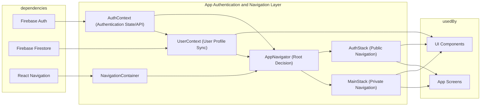

# Application Architecture

## Overview
This guide describes the high-level architecture for the application's navigation and user management. It focuses on how navigation (MainStack/AuthStack), authentication (AuthContext), and user data (UserContext) modules work together to provide secure access, manage user sessions, and display user-relevant content. These modules are central to deciding what content a user can see and how their experience is personalized.

## Key Features

- **Authentication Flow Control**: Dynamically routes users to authenticated or unauthenticated stacks based on their login status.
- **Persistent User Sessions**: Automatically restores the user's session on app restart, using real-time Firebase authentication tracking.
- **Role-Based Navigation**: Segregates navigation into public (AuthStack) and private (MainStack) areas to protect secure app features.
- **Real-Time User Profile Sync**: Monitors and updates the user's profile from Firestore with immediate propagation to the app.
- **Auth Management API**: Provides core authentication actions (sign in, sign up, sign out, password reset) via a unified context interface.
- **Separation of Concerns**: Decouples authentication status, user profile, and navigation logic for maintainability and reusability.

## System Errors

- **Authentication Errors**:  
  Such as invalid credentials, user-not-found, or email-already-in-use.  
  _Resolution_: Surfaces errors from Firebase to the UI layer for user feedback; validate inputs before calling.

- **User Data Not Found**:  
  Occurs if no Firestore profile exists for a valid user session.  
  _Resolution_: Check Firestore rules and user creation flow; ensure profile documents are created upon registration.

- **Network/Sync Issues**:  
  Firebase methods may fail on poor networks, causing loss of session or data sync delay.  
  _Resolution_: Implement retry logic and show appropriate loading/error messages in the UI.

## Usage Examples

```javascript
// Access current authentication status and actions
import { useAuth } from './context/AuthContext';

const { currentUser, signIn, signUp, logOut, resetPassword } = useAuth();

// Sign in a user
signIn('user@example.com', 'pass123')
  .then(() => { /* Navigate to MainStack */ })
  .catch((err) => { /* Show error to user */ });

// Access current user's profile (auto-syncs with Firestore)
import { useUser } from './context/UserContext';
const { profile } = useUser();

// Conditionally render navigation based on auth status
const AppNavigator = () => {
  const { currentUser, loading } = useAuth();
  if (loading) return <LoadingView />;
  return currentUser ? <MainStack /> : <AuthStack />;
};
```

## System Integration


