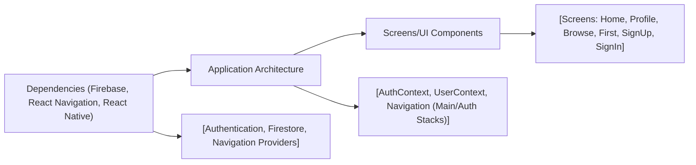

# Application Architecture

## Overview
This React Native Expo application leverages Firebase for user authentication and profile management, utilizing a modular navigation and context-based architecture. The architecture separates concerns across authentication flows, user data, app navigation, and screen rendering, ensuring a scalable foundation for user-centric mobile apps.

The system provides a clear distinction between authenticated and unauthenticated states, displaying the appropriate navigation stacks and handling user context throughout the app's lifecycle.

## Key Features

- **Authentication Flow Management**:  
  Directs users to registration, login, or main application flow based on their authentication state via context providers and conditional navigation.

- **Context Providers (Auth & User)**:  
  - **AuthContext**: Centralizes authentication logic with Firebase (sign up, sign in, password reset, log out, current user tracking).
  - **UserContext**: Manages real-time user profile data fetched from Firestore and makes it globally accessible.

- **Navigation Architecture**:
  - **AuthStack**: Handles onboarding and sign-in/sign-up screens for unauthenticated users.
  - **MainStack**: Provides a tab-based navigation experience for authenticated users (Home, Browse, Profile).

- **Seamless State-driven Navigation**:  
  Automatically switches between authentication and main flows based on user login state.

- **Form Validation and Error Display**:  
  User registration and login forms validate input and present helpful error messages, improving user experience.

- **Profile-aware UI**:  
  User information (such as name) is dynamically rendered across relevant app screens after login.

## System Errors

- **Invalid Credentials**:  
  *Description*: Attempt to log in with incorrect email or password.  
  *Resolution*: An error message is displayed to the user. Recommend checking credentials and retrying.

- **Email Already In Use**:  
  *Description*: User tries to register with an email that already has an account.  
  *Resolution*: Display an informative error, prompt user to log in instead or use a different email.

- **Weak Password**:  
  *Description*: Registration attempt with a password not meeting Firebase's security criteria.  
  *Resolution*: Inform the user to enter a stronger password (at least 6 characters).

- **Firestore/Network Errors**:  
  *Description*: Issues persisting or fetching profile data from Firestore (e.g., connectivity).  
  *Resolution*: Log errors for debugging, optionally display a generic error message, and prompt user to retry later.

- **User Not Found (Profile Fetch)**:  
  *Description*: After login, Firestore contains no profile data for the user.  
  *Resolution*: Log as "No such user!" and direct users to complete profile setup if appropriate.

## Usage Examples

```jsx
// Wrap your application with AuthProvider and UserProvider (usually in App.js)
import { AuthProvider } from './context/AuthContext';
import { UserProvider } from './context/UserContext';

export default function App() {
  return (
    <AuthProvider>
      <UserProvider>
        <NavigationContainer>
          <AppNavigator />
        </NavigationContainer>
      </UserProvider>
    </AuthProvider>
  );
}
```

```jsx
// Access authentication methods in your screen components
import { useAuth } from '../context/AuthContext';

const { signIn, signUp, currentUser } = useAuth();

signIn('user@email.com', 'password123')
  .then(() => { /* on success, navigation handled */ })
  .catch(error => { /* handle and display error */ });
```

```jsx
// Use user profile data in screens
import { useUser } from '../context/UserContext';

const { profile } = useUser();
<Text>Bienvenue {profile.FirstName} {profile.LastName}</Text>
```

## System Integration



**Legend:**
- **Dependencies**: Firebase services & React Native infrastructure.
- **Application Architecture**: Core orchestration layer (context, navigation).
- **Used By**: Screens and reusable components consume context and navigation entry points.
- **Details/Process**: 
  - Context providers orchestrate authentication and user state,
  - Navigation switches between Auth and Main stacks based on state,
  - Individual screens render data and call context methods as needed.
- **Consumers**: Screens show the correct UI and consume both navigation and user/context data.