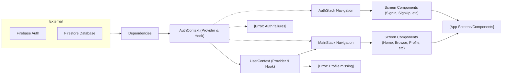

# App Architecture

## Overview
This module defines the core architectural pattern for the Expo-Firebase boilerplate project. It orchestrates authentication and user state management across the application using React Context providers, and conditionally renders navigation flows for authenticated and unauthenticated users. The architecture ensures seamless user onboarding by integrating Firebase Auth, real-time user profile updates via Firestore, and dynamic navigation via React Navigation stacks/tabs.

## Key Features
- **Authentication State Management**: Maintains and exposes authentication state (sign-in, sign-up, sign-out, password reset) across the application via `AuthContext`.
- **User Profile Synchronization**: Loads and updates user profile data in real-time from Firestore using `UserContext`, tied to the authenticated user.
- **Dynamic Navigation Routing**: Switches between authenticated (`MainStack`) and unauthenticated (`AuthStack`) navigation flows based on current user status.
- **Stack and Tab Navigation**: Separates concerns between authentication (using stack navigation) and main application areas (using a bottom tab navigator).
- **Provider Composition**: Wraps providers to ensure all screens, regardless of auth status, have access to user and authentication contexts.

## System Errors
- **Authentication Errors**: Errors from Firebase Auth such as invalid credentials, user not found, or email already in use.  
  *Resolution*: Catch and display error messages in the UI; ensure input validation before making requests.
- **Profile Data Not Found**: Attempting to load a user profile document that does not exist in Firestore.  
  *Resolution*: Implement user creation logic upon registration to ensure profiles exist; check for document existence in the UI.
- **Network/Connectivity Issues**: Failures in connecting to Firebase services (Auth or Firestore).  
  *Resolution*: Inform the user, possibly with a retry option; ensure graceful error handling for offline scenarios.
- **Provider/Context Misuse**: Attempting to use `useAuth` or `useUser` outside their respective providers.  
  *Resolution*: Only use these hooks in components below the corresponding Provider in the tree.

## Usage Examples

```jsx
// Accessing authentication state and actions
import { useAuth } from './context/AuthContext';

function MyComponent() {
  const { currentUser, signIn, signUp, logOut } = useAuth();

  // Example: sign in user
  const handleLogin = () => {
    signIn('user@example.com', 'password123').catch(e => alert(e.message));
  };

  return (
    <View>
      {currentUser ? (
        <Button title="Sign Out" onPress={logOut} />
      ) : (
        <Button title="Sign In" onPress={handleLogin} />
      )}
    </View>
  );
}

// Accessing live user profile data
import { useUser } from './context/UserContext';

function ProfileScreen() {
  const { profile } = useUser();
  return <Text>{profile.displayName}</Text>;
}

// Application composition (in App.js)
export default function App() {
  return (
    <AuthProvider>
      <UserProvider>
        <NavigationContainer>
          <AppNavigator />
        </NavigationContainer>
      </UserProvider>
    </AuthProvider>
  );
}
```

## System Integration


