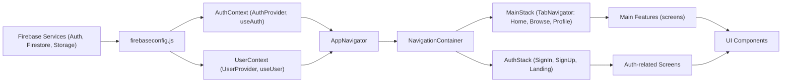

# Expo Firebase Boilerplate Architecture

## Overview
This architecture provides a feature-rich foundation for Expo React Native apps integrated with Firebase services. It covers authentication, persistent user profile management, and a modular navigation system. The design abstracts complex Firebase setup behind React Contexts and navigation stacks, ensuring a scalable, maintainable codebase for rapid app development.

## Key Features

- **Firebase Integration**: Centralized initialization and configuration of Firebase services (Authentication, Firestore, Storage) with secure environment variables and persistent local storage.

- **Authentication Context**: Global state management for user authentication, providing sign-up, sign-in, password reset, and logout across the app using a context-based provider.

- **User Profile Management**: Real-time loading and global availability of user profile data from Firestore, automatically updating user-related information via context when authentication state changes.

- **Dynamic Navigation Routing**:
  - **AuthStack**: Displays authentication screens (sign-in, sign-up, landing) for unauthenticated users.
  - **MainStack**: Shows the primary app (tab-based navigation: Home, Browse, Profile) for authenticated users.

- **Persistent Auth**: Leverages AsyncStorage to persist and restore user sessions between app launches for a seamless user experience.

- **Seamless Context Integration**: Stacks are wrapped with providers (AuthProvider & UserProvider) so all screens/components can access authentication and user profile data without prop drilling.

## System Errors

- **Authentication Error**: Incorrect credentials, network failures, or Firebase configuration mistakes may cause sign-in/sign-up failures.
  - **Resolution**: Check Firebase project credentials, ensure device is online, handle errors in UI.
- **Profile Loading Error**: Firestore user document missing or network issues can result in the user profile not loading.
  - **Resolution**: Ensure user docs are created at sign-up, verify Firestore rules, check connectivity.
- **Persistence Failure**: Issues with AsyncStorage may prevent the restoration of sessions.
  - **Resolution**: Ensure AsyncStorage is installed and linked, check device storage space, debug storage access permissions.

## Usage Examples

```javascript
// Accessing authentication and user profile in a screen
import React from 'react';
import { useAuth } from './context/AuthContext';
import { useUser } from './context/UserContext';

export default function ProfileScreen() {
    const { currentUser, logOut } = useAuth();
    const { profile } = useUser();

    return (
        <View>
            <Text>User ID: {currentUser?.uid}</Text>
            <Text>Name: {profile?.name}</Text>
            <Button title="Logout" onPress={logOut} />
        </View>
    );
}
```

Authentication and navigation are automatically managed:

```javascript
// App.js - wraps everything with providers and navigation
export default function App() {
  return (
    <AuthProvider>
      <UserProvider>
        <NavigationContainer>
          <AppNavigator />
        </NavigationContainer>
      </UserProvider>
    </AuthProvider>
  );
}
```

Firebase is configured once and shared:

```javascript
// firebaseconfig.js
import { FB_AUTH, FB_DB, FB_STORE } from './firebaseconfig';

// Used in context/AuthContext.js and context/UserContext.js
```

## System Integration



**Legend:**
- `firebaseconfig.js`: Initializes Firebase services.
- `AuthContext`: Manages authentication state and exposes sign-in/sign-up flows.
- `UserContext`: Listens to current user's Firestore profile and provides it globally.
- `AppNavigator`: Chooses AuthStack or MainStack based on user state.
- `NavigationContainer`: Hosts all navigation logic.
- `AuthStack`/`MainStack`: Handle routing for logged out/in users.
- `UI Components`: Consume both AuthContext and UserContext as needed.

---

This architecture ensures a clean split between authentication, user data, navigation, and feature screens, providing a robust and extensible foundation for any Expo + Firebase mobile project.