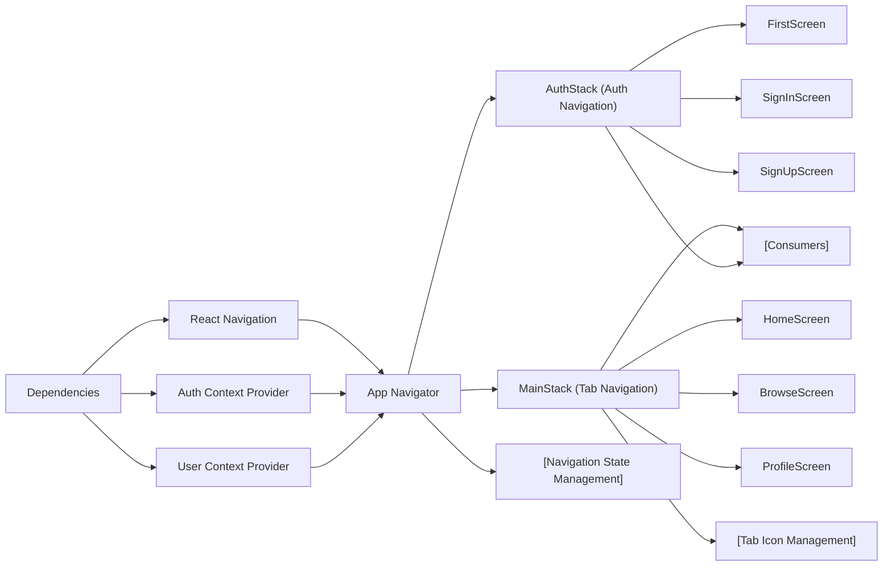

# Navigation Architecture

## Overview
The navigation architecture module is responsible for managing user flow throughout the app, controlling how users move between authentication screens and main app features. It orchestrates the rendering of either authentication-related screens or primary application content based on the user's authentication state, ensuring a seamless and secure user experience.

## Key Features
- **Authentication Flow Routing**: Dynamically directs users to login/sign up or the main application content depending on their authentication status.
- **Stack-Based Navigation**: Utilizes stack navigators for deep navigation within authentication flows (First Screen, Sign Up, Sign In).
- **Tab Navigation for Main App**: Organizes the main app experience into easily accessible Home, Browse, and Profile screens using a bottom tab navigator.
- **User Context Integration**: Incorporates user context providers, allowing screens to access authentication and user profile data throughout the navigation tree.
- **State Preservation and Navigation Reset**: Provides functionality to reset navigation stacks when users sign in, sign out, or create a new account, maintaining logical navigation history.

## System Errors
- **Navigation Reset Failures**: Sometimes, programmatic resets using `navigation.reset()` can lead to unexpected routing or stale screens, especially if the navigation prop is misconfigured.  
  **Resolution**: Ensure that stack navigator names match those referenced in navigation actions; validate that all routes are properly registered.
- **Unregistered Screen Errors**: If a screen name does not match the declared screens in the stack/tab navigators (e.g., navigating to 'ForgotPassword' without registering it), navigation will fail.  
  **Resolution**: Register all possible destination screens in their relevant navigator component.
- **State Context Absence**: If context providers (AuthProvider/UserProvider) are removed or misordered in the tree, navigation-dependent user states (currentUser, signIn, signUp, etc.) may be undefined, resulting in blank screens or JS errors.  
  **Resolution**: Always wrap the NavigationContainer with the AuthProvider and UserProvider as shown in the main `App.js`.

## Usage Examples

```javascript
// Example: Navigating based on authentication state (from App.js)
export default function App() {
  return (
    <AuthProvider>
      <UserProvider>
        <NavigationContainer>
          <AppNavigator />
        </NavigationContainer>
      </UserProvider>
    </AuthProvider>
  );
}

// Example: Sign in and navigation reset (from SignInScreen)
signIn(email, password)
  .then(() => {
    navigation.reset({ index: 0, routes: [{ name: 'Main' }] });
  })

// Example: Sign up, register user profile, then enter main app (from SignUpScreen)
signUp(email, password)
  .then((userCredential) => {
    return setDoc(doc(FB_DB, 'users', userCredential.user.uid), {
      FirstName: firstName,
      LastName: lastName,
    });
  })
  .then(() => {
    navigation.reset({ index: 0, routes: [{ name: 'Main' }] });
  })
```

## System Integration


