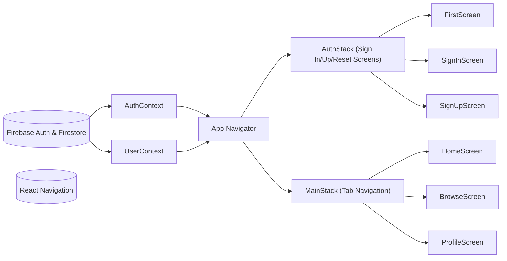

# Expo Firebase Boilerplate Architecture

## Overview
This architecture module describes the high-level structure and flow of the Expo-Firebase-Boilerplate-2 application, focusing on how navigation and authentication systems work together. It clarifies how user authentication status controls navigation between authentication and main app flows, and explains how user profile data is managed across the app. This documentation is intended for developers to understand system behavior and integration points, not internal code details.

## Key Features

- **Authentication State Management**:  
  Centralizes authentication logic (sign up, sign in, sign out, password reset) and keeps real-time track of user's authentication status across the app via `AuthContext`.
  
- **User Profile Data Management**:  
  Uses `UserContext` to provide user profile data, automatically syncing current user's data from Firestore and making it accessible to the app.
  
- **Conditional Navigation Structure**:  
  Dynamically selects between authentication screens (`AuthStack`) and main application screens (`MainStack`) based on user's login state.
  
- **Stack and Tab Navigation**:  
  Separates authentication screens using a stack navigator (`AuthStack`) and main screens using a bottom tab navigator (`MainStack`), providing a modern native look and predictable navigation experience.

## System Errors

- **Authentication Error**:  
  *Description*: Error in sign-up, sign-in, or sign-out (e.g., wrong credentials, network issue).  
  *Resolution*: Inspect error messages returned from Firebase, display feedback to user, and guide corrective action (e.g., retry, check credentials).

- **Profile Sync Error**:  
  *Description*: User profile could not be loaded from Firestore (e.g., document missing, permission denied).  
  *Resolution*: Log error, consider fallback UI, and ensure Firestore rules and user document existence.

- **Navigation State Error**:  
  *Description*: Unexpected navigation state when `currentUser` changes quickly or on logout/login race conditions.  
  *Resolution*: Check loading handling; ensure `loading` states in `AuthContext` are respected before rendering navigation.

## Usage Examples

```javascript
import { useAuth } from './context/AuthContext';
import { useUser } from './context/UserContext';

function MyComponent() {
  const { currentUser, signIn, signOut } = useAuth();
  const { profile } = useUser();

  // Sign in user
  function handleLogin(email, password) {
    signIn(email, password)
      .then(() => console.log('Logged in'))
      .catch(err => console.error('Auth error', err));
  }

  // Access user profile
  if (currentUser && profile) {
    return <Text>Welcome, {profile.displayName}</Text>;
  }

  return <Button title="Login" onPress={() => handleLogin('test@example.com', 'password123')} />;
}
```

## System Integration



**Legend:**  
- `AuthContext` manages authentication and exposes state/actions to the app.  
- `UserContext` provides real-time user profile data via Firestore.  
- `AppNavigator` chooses stack (`AuthStack` or `MainStack`) based on authentication status.  
- Navigation flows (auth or main) are separate and reflect user state in real time.