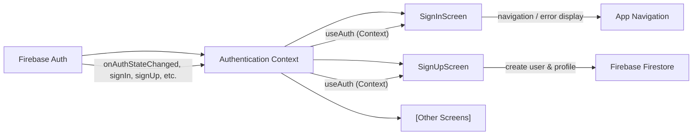

# Authentication Context

## Overview
The Authentication Context module provides a centralized and consistent way to manage user authentication state and actions across the application. It exposes public APIs for account creation, sign-in, sign-out, and password reset, while automatically tracking and updating user session state. This ensures all components in the app can easily access authentication data and methods, streamlining secure access to both screens and backend features.

## Key Features
- **Centralized Authentication State**: Maintains the current user's authentication status and makes it available throughout the app via React Context.
- **User Sign-In**: Allows users to log in with email and password, verifying credentials with Firebase Authentication.
- **User Registration**: Supports creating new user accounts (sign up) with email and password.
- **Password Reset**: Enables users to initiate password reset emails.
- **Sign Out**: Provides a method for logging out the authenticated user.
- **Loading State Handling**: Indicates when the authentication state is being resolved, helping UI components handle conditional loading or gating.
- **Public API via `useAuth` Hook**: Exposes session state (`currentUser`, `loading`) and authentication actions (`signIn`, `signUp`, `logOut`, `resetPassword`) to any React component.

## System Errors
- **auth/invalid-credential**: Triggered when a user attempts to sign in with incorrect email or password.  
  **Resolution**: Display an error message to the user and prompt for correct credentials.
- **auth/email-already-in-use**: Occurs during user registration if the provided email is already associated with an existing account.  
  **Resolution**: Inform the user and prompt for a different email address.
- **auth/invalid-email**: The provided email is malformed or not accepted by Firebase Auth.  
  **Resolution**: Notify the user to correct the email format.
- **auth/weak-password**: Password does not meet Firebase's minimum security requirements (e.g., fewer than 6 characters).  
  **Resolution**: Prompt user to provide a stronger password.
- **General Connectivity/Unknown Errors**: Other errors (such as network failures) may be logged to the console for troubleshooting but should be communicated to users as generic failures as needed.  
  **Resolution**: Suggest trying again or checking network connection.

## Usage Examples

```javascript
// Access authentication methods and user state in any React component:

import { useAuth } from '../context/AuthContext';

function MyComponent() {
  const { currentUser, signIn, signUp, logOut, resetPassword, loading } = useAuth();

  // Sign in a user
  const handleLogin = async (email, password) => {
    try {
      await signIn(email, password);
      // Redirect or show authenticated content
    } catch (error) {
      // Handle error (see System Errors)
    }
  };

  // Sign up a new user
  const handleRegister = async (email, password) => {
    try {
      await signUp(email, password);
      // Additional logic after successful registration
    } catch (error) {
      // Handle error
    }
  };

  // Password reset
  const handleReset = async (email) => {
    try {
      await resetPassword(email);
      // Notify user to check their email
    } catch (error) {
      // Handle error
    }
  };

  // Log out
  const handleLogout = async () => {
    await logOut();
    // Redirect to sign-in or landing page
  };

  return (
    // Render UI based on currentUser, loading, etc.
  );
}
```

## System Integration



- **Dependencies**: Firebase Authentication (for account/session management), Firebase Firestore (for additional user profile data at registration)
- **This Module**: Exposes authentication state/actions as a public React Context
- **Used By**: Screens such as SignIn, SignUp, and any component via `useAuth` hook
- **Details**: Handles session persistence, error propagation, and public API contract
- **Process**: Auth flow (sign in, sign up, logout, password reset), state updates, error management
- **Consumers**: UI screens and app navigation based on authentication state

---
This document describes only public features, error contracts, and usage patterns. Internal implementation details (styles, state hooks, etc.) are intentionally omitted.