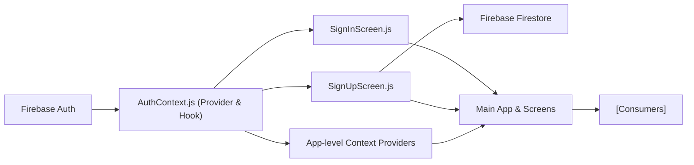

# Authentication Module

## Overview
The Authentication module provides centralized user authentication for the application, enabling users to sign up, sign in, reset passwords, and log out. It orchestrates user session management and exposes public authentication APIs to all screens through React Context, ensuring a consistent and secure authentication experience across the app.

## Key Features
- **User Sign Up**: Allows new users to register with an email and password. Additional profile details (first name, last name) can be stored in Firestore after successful registration.
- **User Sign In**: Permits existing users to log in using email and password. The session state is managed and shared across the app.
- **Password Reset**: Enables users to request a password reset email if they have forgotten their credentials.
- **User Log Out**: Handles terminating the current session and clearing authentication state.
- **Real-time Auth State**: Reactively tracks authentication changes (login/logout) and updates `currentUser` throughout the app.
- **Context Integration**: Provides authentication state and functions to all components/screens via `useAuth()` hook.

## System Errors
- **Invalid Credential Error**: Returned when login credentials are incorrect.  
  _Resolution_: Prompt user to check email/password and retry.
- **Email Already In Use**: Occurs during sign up if the email is already registered.  
  _Resolution_: Advise the user to log in or use password recovery.
- **Invalid Email Error**: Email formatting is invalid during signup.  
  _Resolution_: Ask user to provide a valid email address.
- **Weak Password Error**: Password does not meet minimum length requirements (usually at least 6 characters).  
  _Resolution_: Request user to enter a stronger password.
- **Empty Field Errors**: Any field left blank in sign in/sign up forms.
  _Resolution_: Validate and ensure all required fields are completed.
- **Generic Error**: Any other unspecified error from Firebase or Firestore APIs.  
  _Resolution_: Log error for debugging and display a generic message to the user.

## Usage Examples

```jsx
// Accessing authentication features from a screen (e.g., SignInScreen.js)
import { useAuth } from '../context/AuthContext';

function ExampleScreen() {
  const { signIn, signUp, logOut, resetPassword, currentUser } = useAuth();

  // Sign In
  signIn('user@example.com', 'userpassword')
    .then(() => { /* handle navigation or state update */ })
    .catch((error) => { /* handle error */ });

  // Sign Up
  signUp('newuser@example.com', 'newpassword')
    .then((userCredential) => { /* store extra user info in Firestore */ })
    .catch((error) => { /* handle error */ });

  // Log Out
  logOut()
    .then(() => { /* user is logged out */ });

  // Password Reset
  resetPassword('user@example.com')
    .then(() => { /* inform user to check their email */ });
}
```

## System Integration



- **Dependencies**: The module depends on Firebase Auth and Firestore for user management and profile storage.
- **This Module**: AuthContext acts as the service provider, exposing public authentication APIs and state.
- **Process**: Screens (SignIn, SignUp) call AuthContext functions to manage user lifecycle; SignUp additionally stores user data in Firestore.
- **Used By / Consumers**: All app screens/components needing authentication and user session information consume this context, ensuring access to the latest user state and actions.