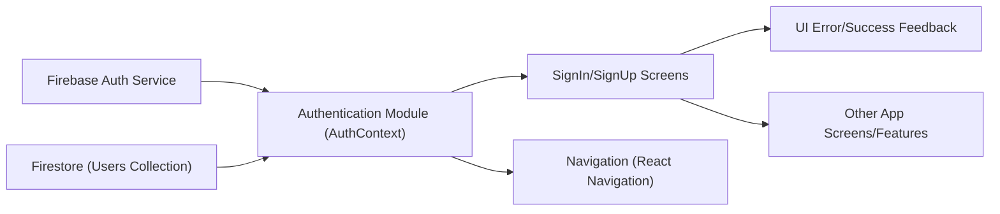

# Authentication Module

## Overview
The Authentication Module provides centralized user authentication for the Expo-Firebase application. It manages user sign-in, sign-up, session state, and logout using Firebase Authentication services. The module ensures secure user access, maintains authentication state throughout the app, and offers easy integration points for UI components to interact with authentication workflows.

## Key Features
- **Centralized Auth State Management**: Provides global context for the user's authentication status, accessible from any part of the app via React Context API.
- **User Sign-Up**: Allows users to register with email and password and supports storing additional user profile information in Firestore.
- **User Sign-In**: Enables users to log in using their email and password, with real-time error feedback for invalid credentials.
- **Password Reset**: Supports sending password reset emails through Firebase for users who forgot their password.
- **Logout**: Lets authenticated users safely log out, clearing their session across the app.
- **Error Handling & Messaging**: Surfaces common Firebase authentication errors to the UI for user-friendly feedback during registration and login.
- **Loading State Handling**: Exposes a loading state to signal when authentication status is being determined (e.g., on app startup).

## System Errors
It's important to document common errors and troubleshooting specifics:
- **auth/email-already-in-use**: Attempting to register with an email that is already associated with an account.  
  **Resolution**: Prompt the user to use another email or to log in.
- **auth/invalid-email**: Email format is invalid during sign-up or sign-in.  
  **Resolution**: Ask the user to input a valid email address.
- **auth/weak-password**: Password does not meet security requirements during registration.  
  **Resolution**: Instruct the user to choose a stronger password (at least 6 characters).
- **auth/invalid-credential**: Email or password is incorrect during sign-in.  
  **Resolution**: Inform the user to check their credentials.
- **Network or Firebase errors**: Issues connecting to Firebase or reading/writing profile data.  
  **Resolution**: Notify the user of connectivity issues and recommend retrying.

## Usage Examples

```javascript
// Accessing authentication state and actions
import { useAuth } from '../context/AuthContext';

// Inside a React component
const { currentUser, signIn, signUp, logOut, resetPassword, loading } = useAuth();

// Signing in a user
signIn(email, password)
  .then(() => {
    // Navigate to the main app screen on success
  })
  .catch(error => {
    // Handle sign-in errors (e.g., invalid credentials)
  });

// Signing up a new user and saving additional data
signUp(email, password)
  .then(userCredential => {
    // Save user profile in Firestore
    const userDocRef = doc(FB_DB, 'users', userCredential.user.uid);
    return setDoc(userDocRef, { FirstName: firstName, LastName: lastName });
  })
  .catch(error => {
    // Handle sign-up errors (e.g., email in use, weak password)
  });

// Resetting a forgotten password
resetPassword(email)
  .then(() => {
    // Notify user to check their email
  })
  .catch(error => {
    // Handle reset errors (e.g., invalid email)
  });

// Logging out
logOut()
  .then(() => {
    // User is logged out, redirect to login screen if necessary
  });
```

## System Integration



**Explanation:**
- `Firebase Auth Service` integrates with the Authentication Module to perform sign-in, sign-up, logout, and password reset actions.
- The Authentication Module (AuthContext) exposes authentication state and actions to all consuming components/screens (e.g., SignInScreen, SignUpScreen).
- During sign-up, additional profile data is written to Firestore's Users collection via the module.
- UI components (like SignInScreen, SignUpScreen) use the module to manage user flow and surface error/success feedback.
- On auth state change, navigation is directed accordingly.
- Other features/screens in the app can access current user/auth state via the module for protected routes and user-specific content.