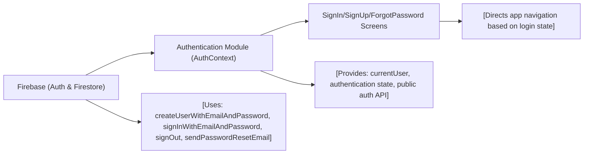

# Authentication Module

## Overview
The Authentication module provides a centralized solution for managing user authentication and session state within the app. It leverages Firebase Authentication to enable account creation, sign-in, sign-out, and password reset workflows. This module ensures authentication status is available throughout the application, facilitating secure gatekeeping of user flows.

## Key Features

- **User Sign Up**: Allows new users to create an account using email and password. Upon successful registration, additional profile data is stored in Firestore.
- **User Sign In**: Enables registered users to log in using their email and password, establishing an authenticated session.
- **Authentication State Management**: Listens for changes in the authentication state and makes the current user information available throughout the app via React Context.
- **Password Reset**: Provides functionality for users to request password reset emails via Firebase.
- **Sign Out**: Enables authenticated users to log out, ending their current session and clearing authentication state globally.
- **Persistent Session**: Supports automatic session persistence across app restarts using React Native's AsyncStorage.

## System Errors

- **auth/email-already-in-use**: Triggered during sign up if the provided email is already associated with an existing account.  
  *Resolution*: Use a different email or try logging in instead.

- **auth/invalid-email**: Triggered if the supplied email is not formatted correctly (sign up or sign in).  
  *Resolution*: Enter a valid email address.

- **auth/weak-password**: Password does not meet Firebase's security criteria (minimum 6 characters).  
  *Resolution*: Choose a stronger password.

- **auth/invalid-credential**: Email and password combination doesn't match any account (sign in).  
  *Resolution*: Double-check your credentials and try again.

- **No Credential Input**: Triggered in the UI if email or password fields are left empty.  
  *Resolution*: Ensure all fields are filled before submitting.

## Usage Examples

```javascript
// AuthContext usage example
import { useAuth } from '../context/AuthContext';

// Sign up a user
const { signUp } = useAuth();
signUp('user@email.com', 'mypassword123')
  .then(userCredential => {
    // User is created
  })
  .catch(error => {
    // Handle errors, e.g., email in use or weak password
  });

// Sign in a user
const { signIn } = useAuth();
signIn('user@email.com', 'mypassword123')
  .then(userCredential => {
    // User is signed in
  })
  .catch(error => {
    // Handle invalid credentials
  });

// Send a password reset email
const { resetPassword } = useAuth();
resetPassword('user@email.com')
  .then(() => {
    // Email sent
  })
  .catch(error => {
    // Handle errors
  });

// Sign out
const { logOut } = useAuth();
logOut()
  .then(() => {
    // User signed out
  });
```

## System Integration


