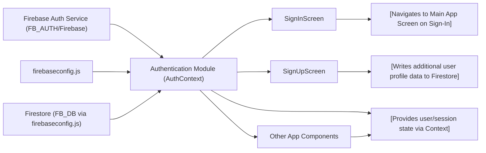

# Authentication Module

## Overview

The Authentication module provides a centralized way for your React Native Expo app to handle user authentication using Firebase Authentication. Exposed via a React Context (`AuthContext`), it offers public APIs for signing up, signing in, logging out, and password reset features. It also manages user session state and ensures authenticated user data is available throughout your app. This module serves as the main entry point for all authentication operations and enables a seamless integration between the UI, Firebase backend, and navigation flows.

## Key Features

- **User Sign Up**: Allows new users to register an account using an email and password, and optionally persists additional user profile info to Firestore.
- **User Sign In**: Authenticates existing users with their email and password, updating the app’s authenticated state.
- **User Sign Out**: Signs out the currently authenticated user and resets authentication state throughout the app.
- **Password Reset**: Supports sending a password reset email if a user forgets their password.
- **Auth State Management**: Automatically updates app-wide authentication state and persists it across sessions via Firebase’s `onAuthStateChanged` listener.
- **Context-based API**: Makes authentication state (`currentUser`, `loading`) and actions (`signUp`, `signIn`, `logOut`, `resetPassword`) easily consumable from any component via the `useAuth` hook.

## System Errors

It's important to document common errors and troubleshooting specifically:

- **auth/invalid-credential**: Incorrect email or password provided during sign-in.
  - **Resolution**: Prompt the user that their credentials are invalid and to try again.
- **auth/email-already-in-use**: During sign-up, the email address is already registered.
  - **Resolution**: Inform the user and ask them to sign in instead, or use a different email.
- **auth/invalid-email**: The email format is incorrect.
  - **Resolution**: Prompt the user to enter a valid email address.
- **auth/weak-password**: Password does not meet Firebase's strength criteria (e.g., less than 6 characters).
  - **Resolution**: Advise the user on password requirements.
- **auth/network-request-failed**: Network error while contacting Firebase services.
  - **Resolution**: Suggest checking the device’s internet connection.
- **Other Firebase errors**: Any other error codes not explicitly handled may occur.
  - **Resolution**: Log these errors for developers; optionally show a generic error message to users.

## Usage Examples

Practical code examples showing how to use the module:

```javascript
// Accessing Auth Context in your component
import { useAuth } from '../context/AuthContext';

// Inside a functional component:
const { signIn, signUp, logOut, currentUser, resetPassword, loading } = useAuth();

// Signing in a user
signIn(email, password)
  .then(() => {
    // Navigate to app main screen or update UI as needed
  })
  .catch((error) => {
    // Handle errors as described above
  });

// Signing up a new user
signUp(email, password)
  .then((userCredential) => {
    // Optionally save additional profile info in Firestore using userCredential.user.uid
  })
  .catch((error) => {
    // Handle errors as described above
  });

// Logging out
logOut()
  .then(() => {
    // Redirect to login screen or update UI
  });

// Sending password reset email
resetPassword(email)
  .then(() => {
    // Inform user to check their email
  })
  .catch((error) => {
    // Handle errors as described above
  });

// Accessing current user
if (currentUser) {
  // User is authenticated
}
```

## System Integration



**Explanation:**  
- The `firebaseconfig.js` file initializes connections to Firebase services and exports configured instances.
- The Authentication module (`AuthContext`) consumes these instances and centralizes sign-in, sign-up, sign-out, and reset-password operations.
- Authentication state and APIs are made available across the app via React Context (`useAuth`), enabling screens like `SignInScreen`, `SignUpScreen`, and any other authenticated component to access user data and methods.
- During sign-up, additional user info (e.g., first and last name) is persisted into Firestore.
- Sign-in and sign-up screens use the context to authenticate and then navigate based on authentication success.
- The module is designed to be the single source of truth for authentication in the app.