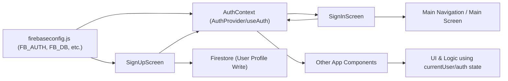

# Authentication Module

## Overview
The Authentication module provides centralized user authentication management for the Expo-Firebase app. It leverages Firebase Authentication to handle user sign-up, sign-in, sign-out, and password reset. This module ensures that user authentication state is managed across the application and makes it easy for other components to access and react to authentication state changes.

## Key Features

- **Authentication Context Provider**: Wraps the application with a context (`AuthProvider`) so that authentication state and actions are available throughout the app using the `useAuth()` hook.
- **User Registration (Sign Up)**: Allows new users to create an account with email and password via Firebase Authentication. Additional profile details (first name, last name) are saved to Firestore.
- **User Login (Sign In)**: Enables existing users to authenticate using their email and password.
- **Password Reset**: Provides a way to request a password reset email to recover a forgotten password.
- **Logout**: Signs the user out of the application and updates the authentication state across all consumers.
- **Authentication State Tracking**: Listens for authentication state changes (login, logout, session expiration) and provides current user info and loading status to other components.

## System Errors

- **auth/invalid-credential**: Triggered during sign-in if credentials are invalid. Display a user-friendly message like “Email or password is incorrect.”
  - _Resolution_: Advise users to check their login information or use the password reset feature.
- **auth/email-already-in-use**: Occurs during registration if the email is already associated with another account.
  - _Resolution_: Suggest users try signing in or using a different email address.
- **auth/invalid-email**: Raised if an invalid email format is entered during registration or password reset.
  - _Resolution_: Ask users to enter a valid email address.
- **auth/weak-password**: Raised if the password is too weak (less than 6 characters) during registration.
  - _Resolution_: Instruct users to choose a stronger password (at least 6 characters).
- **auth/user-not-found or auth/wrong-password (Password Reset/Sign-in)**: Fired when attempting to reset the password or sign in with a non-existent email.
  - _Resolution_: Advise verifying the email address.

## Usage Examples

```javascript
// Wrap your App with AuthProvider in App.js
import { AuthProvider } from './context/AuthContext';

export default function App() {
  return (
    <AuthProvider>
      {/* ... your navigation and screens ... */}
    </AuthProvider>
  );
}

// Use authentication functions in a component
import { useAuth } from '../context/AuthContext';

function LoginForm() {
  const { signIn, resetPassword } = useAuth();

  // Sign in
  signIn(email, password)
    .then(userCredential => {/* handle successful sign-in */})
    .catch(err => {/* handle error */});

  // Request password reset
  resetPassword(email)
    .then(() => {/* notify user of email sent */})
    .catch(err => {/* handle error */});
}

// Example: Accessing current user
const { currentUser } = useAuth();
if (currentUser) {
  console.log('User is signed in:', currentUser.email);
}
```

## System Integration

