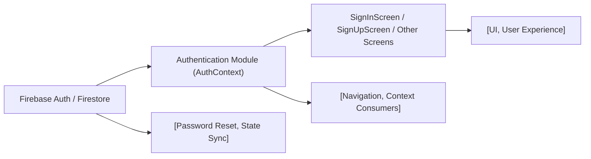

# Authentication Module

## Overview
The Authentication module provides user authentication capabilities for the application, supporting account creation (sign up), user login (sign in), logout, password reset, and real-time authentication state management. This module integrates with Firebase Authentication and exposes public APIs to allow other components to check authentication status or trigger authentication actions. It serves as the central place for managing authenticated sessions in the broader application, ensuring secure access control and user identity management.

## Key Features

- **Authentication Context Provider**: Wraps the application tree to provide authentication state (`currentUser`), status (`loading`), and authentication actions via React Context.
- **Sign Up**: Registers a new user using their email and password, then persists additional profile data (e.g., first name, last name) to Firestore.
- **Sign In**: Authenticates an existing user by email and password, updating the application state and UI on success or failure.
- **Sign Out**: Logs out the current user and resets the authentication state.
- **Password Reset**: Initiates a password reset process for users who forgot their password.
- **Auth State Synchronization**: Real-time listener using Firebase (`onAuthStateChanged`) ensures UI and logic remain in sync with the user's authentication state.
- **Error Feedback and Validation**: Built-in form validation and error handling for common scenarios (e.g., invalid credentials, already-used email).

## System Errors

- **auth/invalid-credential**: Triggered on login when the email or password is incorrect.  
  **Resolution**: Show an error message; prompt user to verify credentials.

- **auth/email-already-in-use**: Occurs during sign up if the email is already registered.  
  **Resolution**: Show a message that the account exists and prompt for login or password reset.

- **auth/invalid-email**: Raised when the email format is invalid (sign up or sign in).  
  **Resolution**: Ask the user to enter a valid email address.

- **auth/weak-password**: During sign up, if the password is less than 6 characters.  
  **Resolution**: Require a stronger password and guide the user to use more characters.

- **auth/user-not-found**: Sign in or password reset, when there is no account with the entered email.  
  **Resolution**: Inform the user and suggest creating an account.

- **Network Errors**: Failed requests due to connectivity issues.  
  **Resolution**: Advise the user to check their internet connection and retry.

## Usage Examples

```jsx
// Wrapping your app with AuthProvider (context/AuthContext.js)
import { AuthProvider } from './context/AuthContext';

export default function App() {
  return (
    <AuthProvider>
      {/* Your navigation and screens */}
    </AuthProvider>
  );
}

// Using signIn in a screen component (screens/SignInScreen.js)
import { useAuth } from '../context/AuthContext';

function MySignIn() {
  const { signIn } = useAuth();
  const handleLogin = () => {
    signIn('user@example.com', 'password123')
      .then(user => { /* Navigate to main app */ })
      .catch(err => { /* Show error message */ });
  };
  // ...
}

// Using signUp and saving profile (screens/SignUpScreen.js)
import { useAuth } from '../context/AuthContext';
import { FB_DB } from '../firebaseconfig';
import { doc, setDoc } from 'firebase/firestore';

function MySignUp() {
  const { signUp } = useAuth();
  const handleSignUp = async () => {
    try {
      const userCredential = await signUp('email', 'password');
      await setDoc(doc(FB_DB, 'users', userCredential.user.uid), {
        FirstName: 'Jane',
        LastName: 'Doe',
      });
      // Navigate to main app
    } catch (error) {
      // Handle errors (see "System Errors" above)
    }
  };
  // ...
}
```

## System Integration



- **Firebase Auth/Firestore** are external dependencies providing backend authentication and profile persistence.
- **Authentication Module (AuthContext)** acts as the bridge, exposing state and actions via React Context to UI components/screens.
- **Screens** (e.g., `SignInScreen`, `SignUpScreen`) act as consumers, invoking context functions and responding to state.
- **Navigation** integrates after authentication actions for routing.
- **Password Reset, State Sync** are internal flows ensuring up-to-date and secure handling of user authentication status.