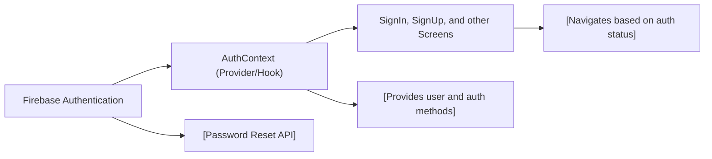

# Authentication Module

## Overview
The Authentication module manages user sign up, sign in, sign out, and session state within the application. It abstracts Firebase Authentication flows for account management and provides authentication context to all components. This makes it easy for screens and features to both access the current user's info and perform authentication actions without tightly coupling to Firebase APIs.

## Key Features

- **Context-based Authentication API**: Exposes React context hooks and provider, giving application-wide access to authenticated user information (`currentUser`, `loading`) and authentication methods (`signUp`, `signIn`, `logOut`, `resetPassword`).
- **Sign Up**: Enables new users to register using email and password through the `signUp` function. On success, registration screens can create additional user profile data in Firestore (see `SignUpScreen.js`).
- **Sign In**: Allows existing users to log in securely with email and password using the `signIn` function.
- **Sign Out**: Supports secure user log out with the `logOut` function, clearing authentication state.
- **Password Reset**: Provides a method for users to reset forgotten passwords via the `resetPassword` function, which sends a reset email through Firebase.
- **Session State Propagation**: Automatically tracks authentication changes and makes user context available throughout the app via the React context API, ensuring screens always see the up-to-date authentication state.

## System Errors

- **auth/invalid-credential**: Displayed when a user provides incorrect email or password during sign in.  
  _Resolution_: Prompt user with "Email or password is incorrect" and allow retry.
- **auth/email-already-in-use**: Shown during sign up if the provided email is already registered.  
  _Resolution_: Display "Email is already in use" and offer option to log in instead.
- **auth/invalid-email**: Occurs if the email format is not valid during sign up or sign in.  
  _Resolution_: Advise user to enter a valid email address.
- **auth/weak-password**: Triggered when the password does not meet Firebase’s requirement (min 6 characters) on sign up.  
  _Resolution_: Display "Password must be at least 6 characters."
- **Network Errors / Unspecified**: Errors from API failures or unexpected exceptions.  
  _Resolution_: Log errors, display a generic error message, and prompt retry if appropriate.

## Usage Examples

```javascript
// Accessing authentication context anywhere in the app
import { useAuth } from '../context/AuthContext';

function Profile() {
  const { currentUser, logOut } = useAuth();

  return (
    <View>
      <Text>{currentUser?.email}</Text>
      <Button title="Sign Out" onPress={logOut} />
    </View>
  );
}

// Signing in a user (example: in a form handler)
const { signIn } = useAuth();
signIn(email, password)
  .then(() => navigation.reset({ index: 0, routes: [{ name: 'Main' }] }))
  .catch(error => {
    if(error.code === 'auth/invalid-credential') {
      setError("Invalid email or password");
    }
  });

// Registering a user and adding profile data
const { signUp } = useAuth();
signUp(email, password)
  .then(userCredential => {
    const userDocRef = doc(FB_DB, 'users', userCredential.user.uid);
    return setDoc(userDocRef, { FirstName: firstName, LastName: lastName });
  })
  .then(() => navigation.navigate('Main'))
  .catch(error => {/* handle errors as shown above */});
```

## System Integration


**Legend:**  
- "Firebase Authentication" is the external auth provider.  
- `AuthContext` is the app's authentication provider and API layer.  
- "Screens" represent any UI (SignInScreen, SignUpScreen, Profile, etc.) that uses authentication state or methods.  
- Session state and user data are automatically kept up-to-date application-wide, and screens react to these changes for navigation and rendering.