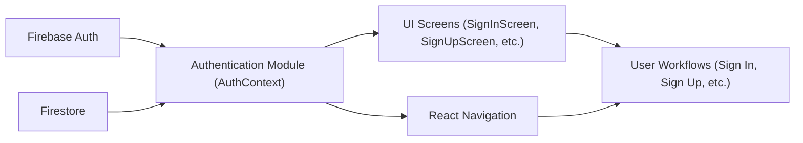

# Authentication

## Overview
The authentication module provides user sign-in, sign-up, password reset, and authentication state management for the app. It centralizes authentication workflows using Firebase Authentication and exposes public APIs for use throughout the UI via React Context. This ensures a secure, scalable, and consistent user authentication experience across all application surfaces.

## Key Features

- **User Sign-Up**: Allows users to create new accounts using their email and password. On successful creation, user profile data can also be initialized in Firestore.
- **User Sign-In**: Enables users to authenticate with email and password and access the app.
- **Password Reset**: Supports workflow for users to request password reset emails if credentials are forgotten.
- **Sign-Out**: Provides a secure sign-out method to end authenticated sessions.
- **Authentication State Management**: Listens to authentication changes, exposes the current user and loading state for consumer components.
- **Context Integration**: APIs (`signIn`, `signUp`, `resetPassword`, `logOut`, `currentUser`, and `loading`) are exposed via React Context for easy, global access in the app.

## System Errors

- **Invalid Credentials (auth/invalid-credential)**: Returned when a user tries to sign in with an unrecognized email/password combination.
  - *Resolution*: Ensure the email and password match an existing account. Advise the user to try again or reset their password.

- **Email Already In Use (auth/email-already-in-use)**: Occurs if a user tries to register with an email that already exists.
  - *Resolution*: Prompt the user to use a different email or sign in instead.

- **Invalid Email (auth/invalid-email)**: Email format does not comply with requirements.
  - *Resolution*: Inform users to check and provide a valid email.

- **Weak Password (auth/weak-password)**: Password does not meet minimum security requirements.
  - *Resolution*: Request that users use a password with at least 6 characters.

- **Network/Unknown Errors**: Occur when Firebase or Firestore operations fail due to network issues or configuration problems.
  - *Resolution*: Advise the user to check their internet connection or try again later. For persistent errors, check Firebase setup.

## Usage Examples

```jsx
// Wrapping the app with AuthProvider (usually in App.js)
import { AuthProvider } from './context/AuthContext';

export default function App() {
  return (
    <AuthProvider>
      {/* ...other providers and navigation */}
    </AuthProvider>
  );
}
```

```jsx
// Using signIn in a screen component (SignInScreen.js)
import { useAuth } from '../context/AuthContext';

function MySignInComponent() {
  const { signIn } = useAuth();
  // ...
  signIn(email, password)
    .then(user => { /* Success flow */ })
    .catch(error => { /* Handle errors as described above */ });
}
```

```jsx
// Using signUp in a SignUpScreen to register and then add user profile details
import { useAuth } from '../context/AuthContext';

function MySignUpComponent() {
  const { signUp } = useAuth();
  signUp(email, password)
    .then(userCredential => {
      // Optionally, set up Firestore profile data here
    })
    .catch(error => { /* See System Errors section for error handling */ });
}
```

## System Integration



- **Dependencies**: Firebase Auth, Firestore, React Context API, React Navigation
- **This Module**: `AuthContext` (exposes authentication methods and state)
- **Used By**: All feature screens/components needing authentication context (`SignInScreen`, `SignUpScreen`, protected routes, etc.)