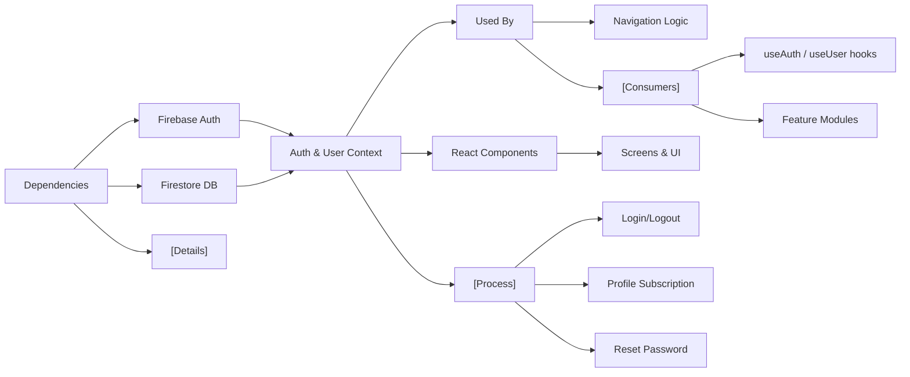

# Authentication and User Context

## Overview
The Authentication and User Context modules provide central management for user authentication state and profile data across your Expo-Firebase application. These modules deliver secure login/logout flows and maintain up-to-date user profile data by connecting your app to Firebase Authentication and Firestore. By exposing simple context APIs, these modules enable any component to reliably access authentication status and user profiles, essential for building personalized app experiences and enforcing access control.

## Key Features

- **Authentication State Management**: Tracks the currently signed-in user and exposes authentication state (logged in/out, loading) throughout the app.
- **Sign Up & Sign In**: Provides public APIs for registering new users and logging in existing users through Firebase Authentication.
- **Password Reset & Logout**: Enables password reset emails and secure logout via context APIs.
- **Reactive User Profile Data**: Maintains a live connection (subscription) to each signed-in user's Firestore profile; any changes to profile data are propagated through UserContext.
- **Easy Access via Hooks**: Use `useAuth()` and `useUser()` hooks in components to access authentication and profile data, without manual prop drilling or boilerplate.

## System Errors

- **Authentication Failure**: This may happen during sign-up or sign-in (e.g., incorrect credentials, email already used).
  - **Resolution**: Handle errors returned from the `signUp` or `signIn` hooks; display meaningful feedback in the UI.
- **Password Reset Error**: Failed password reset email (e.g., invalid email address).
  - **Resolution**: Use error codes from `resetPassword` and inform users of formatting or existence issues.
- **User Profile Not Found**: Firestore document for user profile is missing.
  - **Resolution**: The context logs "No such user!" in console; ensure profile documents are created upon onboarding, and catch this scenario to provide fallback UI if needed.

## Usage Examples

```jsx
import React from "react";
import { useAuth } from "../context/AuthContext";
import { useUser } from "../context/UserContext";

const ProfileScreen = () => {
  const { currentUser, logOut, loading } = useAuth();
  const { profile } = useUser();

  if (loading) return <LoadingSpinner />;

  return (
    <View>
      <Text>Email: {currentUser?.email}</Text>
      <Text>Name: {profile?.displayName}</Text>
      <Button title="Logout" onPress={logOut} />
    </View>
  );
};

// Register new user
const RegisterForm = () => {
  const { signUp } = useAuth();
  const handleRegister = async (email, password) => {
    try {
      await signUp(email, password);
      // Navigate to main app
    } catch (err) {
      // Show error to user
    }
  };
  // ... render form
};
```

## System Integration


