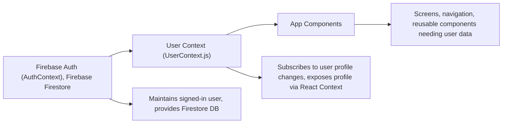

# User Context Data Flow

## Overview
The User Context module manages user profile data across the application. It subscribes to Firebase Firestore updates for the currently authenticated user and exposes the latest profile information through a global context, ensuring consistent and real-time user state for all child components.

## Key Features
- **Real-Time User Profile Sync**: Automatically listens for changes in the authenticated user's Firestore document and updates the profile state throughout the app.
- **Context-Based Access**: Exposes user profile data via a React Context, making it simple for any component in the provider tree to read user info without explicit prop passing.
- **Authentication Integration**: Connects seamlessly with the authentication context (AuthContext) to ensure profile data always matches the logged-in user.

## System Errors
- **No Such User Error**: If the user document does not exist in Firestore, the module will log "No such user!" to the console.  
  *Resolution*: Ensure that a profile document is created for every registered user in the 'users' Firestore collection.
- **Network/Subscription Errors**: Errors during Firestore subscription (such as network failures) are not explicitly handled.  
  *Resolution*: For robust production use, enhance error handling by wrapping Firestore calls in try/catch and provide user feedback or retry logic as needed.

## Usage Examples

```javascript
// Consuming user profile data in a component:
import React from 'react';
import { useUser } from '../context/UserContext';

export default function ProfileScreen() {
  const { profile } = useUser();

  return (
    <View>
      <Text>Welcome, {profile.displayName || 'User'}!</Text>
      {/* Display other profile fields as needed */}
    </View>
  );
}

// Wrapping your app with the provider (already set up in App.js):
import { UserProvider } from './context/UserContext';

<UserProvider>
  {/* ...child components... */}
</UserProvider>
```

## System Integration


