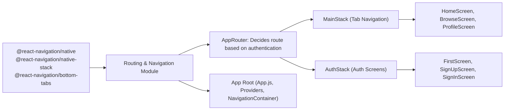

# Routing and Navigation

## Overview

The Routing and Navigation module manages all user navigation flows in the application. It provides a unified system for handling stack-based (authentication) and tab-based (main) navigation, switching users between authentication and main app areas according to their authentication state. This ensures users see the appropriate screens (e.g., login, sign up, dashboard) and allows seamless transitions between key app sections (Home, Browse, Profile).

## Key Features

- **Authentication Stack Navigation**: Manages navigation between screens for unauthenticated users, including welcome, sign-in, and sign-up flows.
- **Main Application Navigation**: Provides a bottom-tab interface for authenticated users, enabling navigation across major app sections: Home, Browse, and Profile.
- **User State-Based Routing**: Dynamically routes users to authentication or main flows depending on their logged-in status.
- **Navigation Container Integration**: Wraps and coordinates navigation using React Navigation’s `NavigationContainer`, establishing the main navigation context for the app.

## System Errors

- **Navigation Mismatch Error**: Occurs if navigation attempts are made to undefined screen names (e.g., typos such as `"FirstPage"` instead of `"FirstScreen"`).  
  **Resolution**: Ensure all `name` props on navigation screens match the intended screen/component names exactly.

- **Authentication State Flicker**: Users may briefly see an incorrect screen if authentication status is loading or delayed.  
  **Resolution**: The loading spinner is rendered during authentication checks. This is normal; for slow responses, review the AuthProvider logic.

- **Broken Navigation Context**: If NavigationContainer is missing or not placed at the root, navigation may not work at all.  
  **Resolution**: Always wrap the app’s main tree in `NavigationContainer` as shown in usage examples.

## Usage Examples

```javascript
// App.js: Application root integrating navigation

import { NavigationContainer } from '@react-navigation/native';
import MainStack from './component/Navigation/MainStack';
import AuthStack from './component/Navigation/AuthStack';

export default function App() {
  return (
    <AuthProvider>
      <UserProvider>
        <NavigationContainer>
          <AppNavigator />
        </NavigationContainer>
      </UserProvider>
    </AuthProvider>
  );
}

// MainStack.js: Bottom tab navigation for authenticated users

import { createBottomTabNavigator } from '@react-navigation/bottom-tabs';

const Tab = createBottomTabNavigator();

function MainStack() {
  return (
    <Tab.Navigator 
      initialRouteName={"HomeScreen"}
      screenOptions={{ headerShown: false, tabBarShowLabel: false }}
    >
      <Tab.Screen name="HomeScreen" component={HomeScreen} />
      <Tab.Screen name="BrowseScreen" component={BrowseScreen} />
      <Tab.Screen name="ProfileScreen" component={ProfileScreen} />
    </Tab.Navigator>
  );
}

// AuthStack.js: Stack navigation for authentication

import { createNativeStackNavigator } from '@react-navigation/native-stack';

function AuthStack() {
  const Stack = createNativeStackNavigator();
  return (
    <Stack.Navigator initialRouteName="FirstScreen" screenOptions={{ headerShown: false }}>
      <Stack.Screen name="FirstScreen" component={FirstScreen} />
      <Stack.Screen name="SignUp" component={SignUpScreen} />
      <Stack.Screen name="SignIn" component={SignInScreen} />
    </Stack.Navigator>
  );
}

// screens/FirstScreen.js: Navigating between SignIn and SignUp

function FirstScreen({ navigation }) {
  return (
    <>
      <Button title="Inscription" onPress={() => navigation.navigate('SignUp')} />
      <Button title="Connexion" onPress={() => navigation.navigate('SignIn')} />
    </>
  );
}
```

## System Integration


