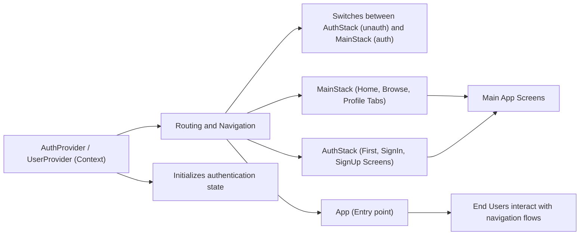

# Routing and Navigation

## Overview
The routing module defines how users move between different screens in the app based on their authentication state. It organizes authentication flows and main application screens using React Navigation's stack and tab navigators, ensuring users only see appropriate content depending on whether they are logged in or not.

## Key Features

- **Authentication-Based Routing**: Dynamically displays either authentication screens or the main app content, depending on whether a user is logged in.
- **Auth Stack**: Groups authentication-related screens (sign in, sign up, first/onboarding screen) in a separate navigator for unauthenticated users.
- **Main Stack (Tab Navigator)**: Provides bottom tab navigation for main areas of the app (Home, Browse, Profile) for authenticated users.
- **Context Integration**: Tightly integrates with authentication and user context providers, ensuring navigation state reflects real-time auth changes.
- **Header & TabBar Management**: Hides headers and tab labels for a streamlined interface and consistent look.

## System Errors

- **Navigation Mismatch**: If user authentication state is not correctly reflected (due to stale or missing context), users may be routed incorrectly.  
  **Resolution**: Ensure authentication context (`AuthProvider`/`useAuth`) is initialized before navigation.
- **Unknown Screen Name**: If a screen name does not match any defined in the navigator (e.g., typo in navigation calls), app may crash or show a blank screen.  
  **Resolution**: Verify all navigation actions use valid, registered screen names.

## Usage Examples

```jsx
// Entry point (App.js)
import React from 'react';
import { NavigationContainer } from '@react-navigation/native';
import { AuthProvider } from './context/AuthContext';
import { UserProvider } from './context/UserContext';

export default function App() {
  return (
    <AuthProvider>
      <UserProvider>
        <NavigationContainer>
          <AppNavigator />  {/* Handles routing based on authentication */}
        </NavigationContainer>
      </UserProvider>
    </AuthProvider>
  );
}

// Inside AppNavigator (App.js)
const { currentUser, loading } = useAuth();
return (
  <Stack.Navigator>
    {currentUser ? (
      <Stack.Screen name="Main" component={MainStack} options={{ headerShown: false }} />
    ) : (
      <Stack.Screen name="Auth" component={AuthStack} options={{ headerShown: false }} />
    )}
  </Stack.Navigator>
);

// AuthStack (component/Navigation/AuthStack.js)
<MainNavigation.Navigator initialRouteName="FirstScreen" screenOptions={{ headerShown: false }}>
  <MainNavigation.Screen name="FirstScreen" component={FirstScreen} />
  <MainNavigation.Screen name="SignUp" component={SignUpScreen} />
  <MainNavigation.Screen name="SignIn" component={SignInScreen} />
</MainNavigation.Navigator>

// MainStack (component/Navigation/MainStack.js)
<Tab.Navigator initialRouteName="HomeScreen" screenOptions={{ headerShown: false, tabBarShowLabel: false }}>
  <Tab.Screen name="HomeScreen" component={HomeScreen} />
  <Tab.Screen name="BrowseScreen" component={BrowseScreen} />
  <Tab.Screen name="ProfileScreen" component={ProfileScreen} />
</Tab.Navigator>
```

## System Integration

