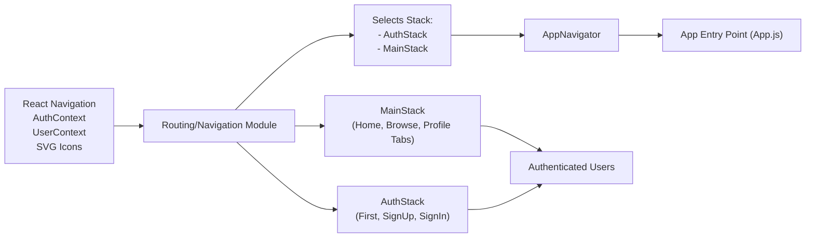

# Routing and Navigation

## Overview
The routing module in this project manages user flow based on authentication status, providing a seamless navigation structure for both authenticated and unauthenticated users. It switches between a protected (MainStack) and an authentication (AuthStack) navigation stack, ensuring each user sees the appropriate screens.

## Key Features

- **Authentication-aware Routing**: Automatically directs users to either the authentication flow or the main app interface based on their sign-in status.  
- **AuthStack Navigation**: Contains onboarding and authentication screens: Welcome, Sign Up, and Sign In. Ensures new or logged-out users can interact with the app.
- **MainStack Navigation**: Provides access to the main app features (Home, Browse, Profile) via a bottom tab navigator, granting a persistent, consistent experience for signed-in users.
- **Centralized Navigation Container**: Leverages React Navigation’s container to encapsulate all navigation logic, benefiting from navigation state management and deep linking support.
- **Context Integration**: Routes are context-aware, automatically reacting to changes in authentication and user context.

## System Errors

- **Navigation Mismatch**: Users are shown the wrong stack (e.g., unauthenticated users see the main stack).
  - **Resolution**: Ensure the authentication context (`useAuth()`) provides the correct `currentUser` state. Check the stack selection logic in AppNavigator.
- **Blank Screen on Load**: Users see a loading spinner indefinitely.
  - **Resolution**: Inspect the `loading` state from `useAuth()`. Ensure authentication state is set correctly in the context provider.
- **Broken Navigation Icons**: Tab icons do not render or appear blank.
  - **Resolution**: Validate that SVG icon imports for Home, Browse, and Profile are correct. Confirm they export valid React components.

## Usage Examples

```jsx
// App.js integration:
// Wrap your entire app in AuthProvider, UserProvider, and NavigationContainer.
// AppNavigator automatically chooses the right navigation stack.

export default function App() {
  return (
    <AuthProvider>
      <UserProvider>
        <NavigationContainer>
          <AppNavigator />
        </NavigationContainer>
      </UserProvider>
    </AuthProvider>
  );
}

// Example: Navigating to the SignIn screen if user not authenticated is automatic.
// The user will see FirstScreen > SignUp/SignIn options by default.
// When currentUser changes (login), navigation switches to MainStack.
```

## System Integration


