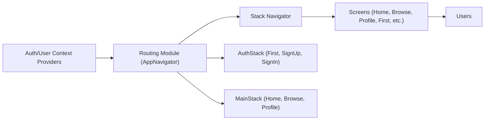

# Routing Module

## Overview
The **Routing module** coordinates user navigation throughout the Expo Firebase Boilerplate app. It dynamically determines which navigation stack to display—authentication or main application—based on the user's authentication state. This module ensures users interact with the appropriate screens, maintaining both security and a fluid user experience.

## Key Features
- **Authentication Stack Navigation**: Presents onboarding, sign-in, and sign-up screens when the user is not authenticated.
- **Main Application Navigation**: Displays core app screens (Home, Browse, Profile) via a customizable tab navigator once the user is authenticated.
- **Dynamic Stack Switching**: Automatically selects which stack (Auth or Main) to render based on real-time authentication state.
- **Navigation Container Integration**: Utilizes React Navigation's container and customizable stack/tab navigators to provide a cohesive navigation environment.

## System Errors
- **Navigator Rendering Error**: Occurs when neither AuthStack nor MainStack is rendered due to an invalid authentication state.
  - **Resolution**: Ensure `useAuth()` correctly provides `currentUser` and `loading`. User should not remain in a loading state indefinitely.
- **Screen Not Found**: If an expected screen is missing from either stack navigator configuration.
  - **Resolution**: Confirm all referenced screens (e.g., "FirstScreen", "SignInScreen", "HomeScreen") are correctly imported and registered in their respective stack/tab navigators.

## Usage Examples
Practical code snippet illustrating dynamic routing and stack usage:

```javascript
import { NavigationContainer } from '@react-navigation/native';
import { AuthProvider, useAuth } from './context/AuthContext';
import MainStack from './component/Navigation/MainStack';
import AuthStack from './component/Navigation/AuthStack';

function AppNavigator() {
  const { currentUser, loading } = useAuth();

  if (loading) {
    return <ActivityIndicator />;
  }

  return (
    <Stack.Navigator>
      {currentUser ? (
        <Stack.Screen name="Main" component={MainStack} />
      ) : (
        <Stack.Screen name="Auth" component={AuthStack} />
      )}
    </Stack.Navigator>
  );
}

export default function App() {
  return (
    <AuthProvider>
      <NavigationContainer>
        <AppNavigator />
      </NavigationContainer>
    </AuthProvider>
  );
}
```

## System Integration
Below is a diagram showing how the Routing module orchestrates navigation based on user's state and connects different navigation stacks:



**Explanation:**
- Context providers supply authentication and user state to Routing Module.
- The Routing Module (AppNavigator) selects which navigator (auth/main) to render.
- Navigators organize and present the relevant screens to users, guaranteeing screen transitions are appropriate for the user's session state.