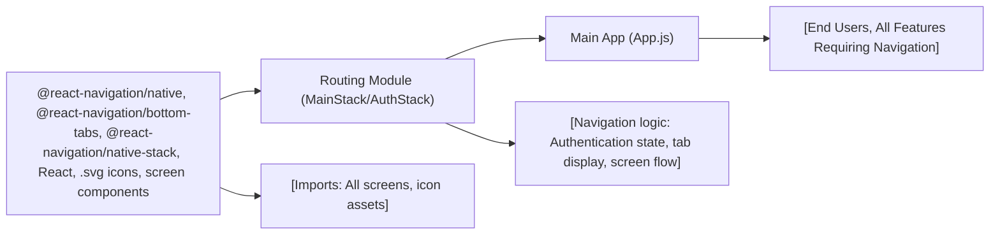

# Routing Module

## Overview
The Routing module organizes screen navigation and user flow throughout the application. It ensures users are presented with the correct set of screens based on their authentication status—displaying onboarding/auth screens or the main application interface as appropriate. This module is the central integration point for all navigable screens and manages overall navigation state.

## Key Features
- **Authentication Flow Routing**: Directs unauthenticated users to sign-in, sign-up, and onboarding screens using a dedicated navigation stack.
- **Main Application Navigation**: Presents authenticated users with a bottom tab navigator, providing access to primary features (Home, Browse, Profile) through dedicated screens and icons.
- **Custom Tab Bar Icons**: Enhances usability and branding by associating SVG icons with each bottom tab.
- **Screen Grouping and Separation**: Separates authentication-related screens from the main application workflow for a clearer navigation structure.

## System Errors
- **Navigation Mismatch/Error**: Occurs if the initial route name does not align with the actual registered screen (e.g., casing mismatch: `"FirstPage"` vs. `"FirstScreen"`).  
  **Resolution**: Ensure `initialRouteName` matches one of the registered screen names in each stack.
- **Icon Import/Rendering Error**: Happens if required SVG assets are missing or wrongly referenced for tab icons.  
  **Resolution**: Verify the presence and correctness of icon paths in the project.
- **Component Reference Error**: Triggered if screens are misnamed or missing from imports or registration.  
  **Resolution**: Confirm that all navigation components are correctly imported and match screen names registered in Navigator.

## Usage Examples

```jsx
// App.js: Setup for using the Routing module

import React from 'react';
import { NavigationContainer } from '@react-navigation/native';
import MainStack from './component/Navigation/MainStack';
import AuthStack from './component/Navigation/AuthStack';

export default function App() {
  const isAuthenticated = // derive authentication state
  
  return (
    <NavigationContainer>
      {isAuthenticated ? <MainStack /> : <AuthStack />}
    </NavigationContainer>
  );
}
```

## System Integration


