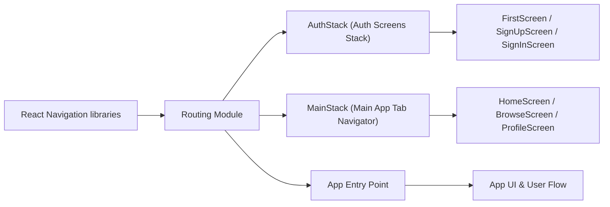

# Routing Module

## Overview
The Routing module defines the navigation structure of the application, orchestrating how users flow between authentication screens and the main feature screens. It leverages React Navigation to organize screens into logical navigation stacks, ensuring a smooth user experience and correct access control based on authentication state.

## Key Features
- **Authentication Stack Navigation**: Manages the screens for user onboarding, sign-up, and sign-in, directing unauthenticated users through the correct flows.
- **Main Application Tab Navigation**: Handles the primary app navigation for authenticated users using a bottom tab bar, giving users easy access to Home, Browse, and Profile screens.
- **Customizable Navigation Options**: Allows customization of header visibility and tab appearance for a clean and cohesive app interface.

## System Errors
- **Missing Screen Component**: If a referenced screen component is missing or misnamed, navigation will result in a runtime error (`Component not found for name...`).  
  _Resolution_: Ensure all screen names and import paths match existing components.
- **Navigation Stack Initialization Error**: Providing an incorrect initial route ("FirstPage" vs. "FirstScreen") or misconfigured navigation options may break the flow or cause blank screens.  
  _Resolution_: Verify the initialRouteName matches a declared screen name; review screenOptions for typos.
- **Icon Asset Import Failure**: If icons used for tab navigation are unavailable, the app may display blanks or crash.  
  _Resolution_: Confirm all SVG/icon assets are present at the specified paths.

## Usage Examples

```javascript
// Example: Integrating AuthStack and MainStack with React Navigation

import { NavigationContainer } from '@react-navigation/native';
import AuthStack from './component/Navigation/AuthStack';
import MainStack from './component/Navigation/MainStack';

export default function AppNavigation({ isAuthenticated }) {
  return (
    <NavigationContainer>
      {isAuthenticated ? <MainStack /> : <AuthStack />}
    </NavigationContainer>
  );
}

// AuthStack automatically routes between FirstScreen, SignUpScreen, and SignInScreen.
// MainStack provides tab navigation for HomeScreen, BrowseScreen, and ProfileScreen.
```

## System Integration


