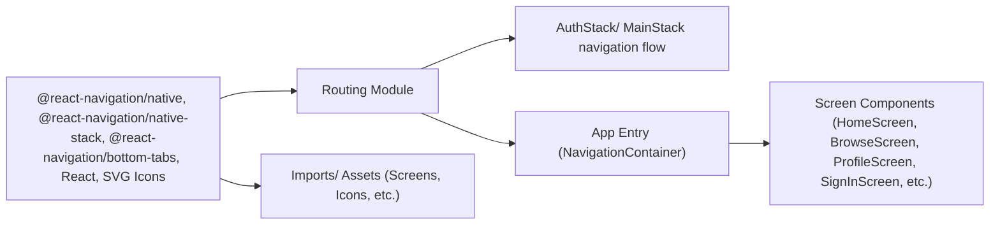

# Routing

## Overview
The routing module manages the navigation flow of the application, controlling how users move between authentication-related screens and the main content areas. It ensures that users are directed to the appropriate set of screens based on their authentication status and provides a tab-based interface for primary app sections.

## Key Features

- **Authentication Stack Navigation**: Separates all authentication-related screens (e.g., sign in, sign up, welcome) into an isolated navigation stack to streamline user onboarding and login workflows.
- **Main Stack Navigation**: Organizes main app screens (Home, Browse, Profile) into a bottom tab bar, allowing seamless transitions between primary content areas.
- **Custom Tab Bar Icons**: Displays distinct icons for each main section, improving user recognition and app usability.
- **Initial Route Handling**: Defines default entry screens for both authentication and main app navigation, ensuring users start at the correct point based on context.

## System Errors
- **Route Name Mismatch**: If initial route names (such as "FirstPage" vs "FirstScreen") don't align with actual screen names, navigation may fail to render.  
  **Resolution**: Ensure the `initialRouteName` property matches one of the defined screen names in the stack.
- **Component Import Errors**: If a screen component is missing or incorrectly imported, navigation will not work as expected.  
  **Resolution**: Confirm that all referenced components (e.g., `FirstScreen`, `SignUpScreen`, `ProfileScreen`) exist and are correctly exported.
- **Icon Asset Loading Issues**: If SVG icon assets are missing or improperly referenced, tab icons might not display.  
  **Resolution**: Verify that icon files exist at the specified paths and are valid SVGs.

## Usage Examples

```javascript
// Import the routing stacks into your top-level navigation controller

import AuthStack from './component/Navigation/AuthStack';
import MainStack from './component/Navigation/MainStack';

// Example integration within a navigation container

import { NavigationContainer } from '@react-navigation/native';

export default function AppRouter({ isAuthenticated }) {
  return (
    <NavigationContainer>
      {isAuthenticated ? <MainStack /> : <AuthStack />}
    </NavigationContainer>
  );
}
```

## System Integration


