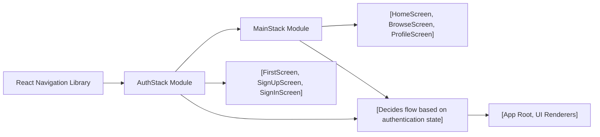

# Routing Module

## Overview
The Routing Module manages user navigation across authentication and main application screens in the Expo-Firebase-Boiler-Plate. It organizes user flow by separating authentication routes (for sign-up, sign-in, and onboarding) from the primary in-app navigation (home, browse, and profile). This design helps enforce access control, user onboarding, and seamless transitions between entry and main user experiences.

## Key Features

- **Authentication Navigation Stack**: Handles all routes related to user authentication. This includes onboarding/introductory screens, sign-up, and sign-in screens. It prevents unauthorized access to protected app sections until authentication is verified.
  
- **Main Application Tab Navigation**: Manages in-app navigation for authenticated users, organizing primary features (Home, Browse, Profile) into a tab-based user experience for quick context switching.
  
- **Screen Grouping**: By grouping screens into logical stacks (AuthStack and MainStack), the module provides a clean separation between unauthenticated and authenticated flows.
  
- **Customizable Navigation Appearance**: Supports configuration for header visibility, tab bar appearance, and tab icons to provide a consistent and branded navigation UI.

## System Errors

- **Invalid Route Name**: Route names must exactly match the declared screen names. Mismatches may cause navigation attempts to fail.
  - **Resolution**: Ensure route parameters and navigation actions use names defined in respective Stack or Tab navigators.

- **Missing Screen Component**: Attempting to navigate to a screen that does not have an associated component import will cause runtime errors.
  - **Resolution**: Verify that all screen names mapped in the navigator have corresponding and correctly imported React components.

## Usage Examples

```javascript
// Example for adding a custom screen to the AuthStack
import AuthStack from './component/Navigation/AuthStack';

// Use AuthStack in your top-level App navigation logic:
<AuthStack />

// Example for accessing MainStack (after authentication)
import MainStack from './component/Navigation/MainStack';

<MainStack />

// Example for navigating between screens inside a screen component:
import { useNavigation } from '@react-navigation/native';

const MyComponent = () => {
  const navigation = useNavigation();
  return (
    <Button onPress={() => navigation.navigate('SignIn')}>Go to Sign In</Button>
  );
};
```

## System Integration

