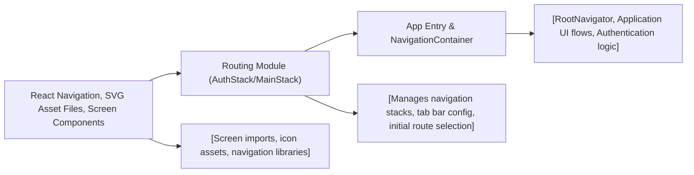

# Routing Module

## Overview
The Routing module provides structured navigation for both authentication and main application flows in the Expo-Firebase boilerplate. It establishes clear separation between unauthenticated (AuthStack) and authenticated (MainStack) user journeys, enabling smooth transitions, consistent user experience, and modular screen management.

## Key Features
- **AuthStack Navigation**: Manages navigation between onboarding and authentication screens (`FirstScreen`, `SignUpScreen`, `SignInScreen`). Ensures users can navigate securely through login and registration workflows.
- **MainStack Navigation**: Manages bottom tab navigation for core app experiences (`HomeScreen`, `BrowseScreen`, `ProfileScreen`). Each tab features a custom icon and provides direct access to primary app functionality.
- **Customizable UI Options**: Configures appearance, tab behavior, and header visibility for seamless user experience across devices.
- **Initial Route Configurations**: Allows definition of starting screens based on user authentication status for both stacks.

## System Errors
- **Screen Not Found**: If a specified screen component is missing or misnamed, navigation may fail or throw an error.  
  *Resolution*: Ensure all target screens are correctly imported and assigned.
- **Icon Load Failure**: If SVG icons are not present or incorrectly referenced, tab icons may not render.  
  *Resolution*: Verify asset paths and ensure dependencies are installed.
- **Navigation Misconfiguration**: Incorrect initialRouteName or navigation arguments can cause the app to start at an unintended screen or crash.  
  *Resolution*: Double check route names and initial route setup in both AuthStack and MainStack.

## Usage Examples
Practical code examples showing how to use the Routing module:

```jsx
// Example: Integrating AuthStack in your root navigator
import AuthStack from './component/Navigation/AuthStack';

function RootNavigator({ isAuthenticated }) {
  return isAuthenticated ? <MainStack /> : <AuthStack />;
}

// Example: MainStack usage (after authentication)
import MainStack from './component/Navigation/MainStack';

// In your App.js or core navigation entrypoint:
function App() {
  const userIsSignedIn = // determine user status (via context or state)
  return (
    <NavigationContainer>
      {userIsSignedIn ? <MainStack /> : <AuthStack />}
    </NavigationContainer>
  );
}
```

## System Integration

