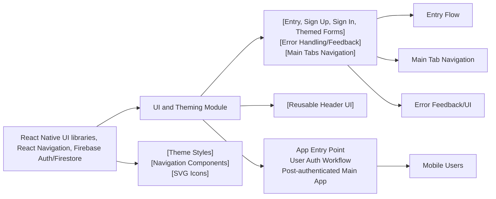

# UI and Theming

## Overview
The UI and Theming module defines the main structure, navigation, and visual style of the authentication flow for the Expo Firebase Boilerplate app. It is responsible for presenting the sign-in/sign-up forms, handling error display within these screens, providing a welcoming entrypoint, and setting up a consistent look and feel—including navigation and branding elements—across core user flows.

This module orchestrates the entry screen, authentication (sign-up and sign-in), and the main navigational stack using a unified style and clear integration with React Navigation's stack and tab navigators.

## Key Features

- **Entry and Authentication Screens**:  
  Presents dedicated screens for new users ("Sign Up") and returning users ("Sign In"), each conforming to a consistent visual theme.
  
- **Centralized Navigation Stack**:  
  Organizes the main tab-based navigation using `MainStack`, offering seamless transitions between Home, Browse, and Profile areas post-authentication.
  
- **Themed UI Elements**:  
  Implements clean, readable design with consistent color usage, rounded components, and space management for both content and errors. Includes branding headers and styled buttons.
  
- **User Guidance and Error Feedback**:  
  Provides actionable feedback directly in forms for required fields, invalid credentials, and other authentication edge cases.
  
- **Header Component**:  
  Offers a reusable header UI stub, ready for branding or application-wide use.
  
- **Flow Control**:  
  Controls user workflow: initial greeting, registration/login choices, handling navigation resets after authentication, and error visibility without page reloads.

## System Errors

- **Missing/Invalid Input**:  
  - **Type**: Validation  
    - Description: If required input fields (first name, last name, email, password) are empty or invalid, corresponding messages are shown directly beneath the input.
    - Resolution: Enter valid data per field instruction (e.g., non-empty, valid email format).
- **Authentication Errors**:
  - **Email Already in Use**:  
    - Type: Auth  
    - Description: Attempting registration with an email already registered.
    - Resolution: Use a different email address or proceed to sign in.
  - **Invalid Email**:  
    - Type: Auth  
    - Description: Registration or login attempt with an invalid email format.
    - Resolution: Enter a valid email address in the "Email" field.
  - **Weak Password**:  
    - Type: Auth  
    - Description: Registration attempt with a password less than 6 characters.
    - Resolution: Enter a password with at least 6 characters.
  - **Incorrect Credentials**:  
    - Type: Auth  
    - Description: Login attempt with invalid email/password.
    - Resolution: Verify credentials or reset password using "ForgotPassword".
- **Other Errors**:
  - **Unspecified Firebase/Navigation Errors**:  
    - Type: Internal/Firebase  
    - Description: Any issues during user registration not matched by the above.
    - Resolution: Check console logs for underlying issues, fix connectivity or configuration.

## Usage Examples

```jsx
// Display the initial entry screen with navigation to SignUp or SignIn
<FirstScreen navigation={navigation} />

// Sign Up form usage – all errors and guidance are handled visually
<SignUpScreen />

// Sign In form with inline validation and navigation to Forgot Password or Sign Up
<SignInScreen />

// Main application tabs after successful authentication
<MainStack />

// Use (or extend) a reusable header for an authenticated area
import Header from '../component/Reusable/Header'
<Header />
```

## System Integration


