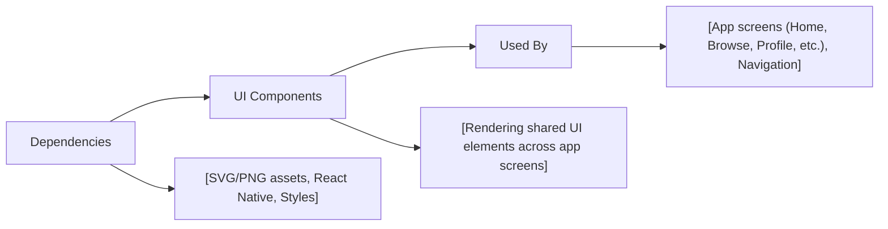

# UI Components

## Overview
The UI Components module provides a set of reusable user interface building blocks for the application. These components deliver a consistent look and feel across the app, enabling rapid feature development and simplified maintenance. They include header elements and icon assets that are commonly used throughout key screens, such as Home, Browse, and Profile.

## Key Features

- **Reusable Header**: Displays a standardized header section at the top of screens. Promotes consistency and can be dropped into any screen for a unified navigation experience.
- **Icon Assets**: Provides SVG icons (Browse, Home, Profile) that can be embedded within navigation elements, tabs, or buttons to improve UX and visual clarity.
- **Branded Images**: Offers branded imagery (favicon, splash, app icons) to ensure visual alignment with the overall product identity during app load, installation, and browser interaction.

## System Errors

- **Missing Icon Asset**: Occurs if a referenced SVG or PNG resource cannot be found.  
  *Resolution*: Ensure all imports and asset paths are correct and assets exist at specified locations.

- **Header Not Rendering**: Happens if the header component is omitted or imported incorrectly in a screen.  
  *Resolution*: Confirm proper import (`import Header from 'component/Reusable/Header'`) and usage within your component JSX.

## Usage Examples

Practical code examples showing how to use the module:

```jsx
// Import reusable UI components and icons
import Header from '../component/Reusable/Header';
import BrowseIcon from '../assets/icons/Browse.svg';
import HomeIcon from '../assets/icons/Home.svg';
import ProfileIcon from '../assets/icons/Profile.svg';

// Use header in a React Native screen
export default function HomeScreen() {
  return (
    <>
      <Header />
      {/* Place HomeIcon or other icons as needed in your UI */}
      <HomeIcon width={24} height={24} fill="#333" />
    </>
  );
}
```

## System Integration


