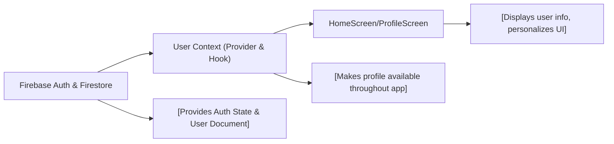

# User and Profile Management

## Overview
The User and Profile Management module provides user profile data to the application after authentication. It retrieves and synchronizes user-specific information from Firestore, makes this data available via React context, and allows other application components—such as screens and features—to display or use profile details. This module ensures that authenticated users always see up-to-date profile information and enables application logic to access current user context.

## Key Features
- **Profile Retrieval and Synchronization**: Listens in real-time to the authenticated user's Firestore document, updating the profile in context automatically whenever changes occur.
- **React Context Integration**: Exposes the user profile throughout the React component tree, making user information easily accessible via the `useUser` custom hook.
- **Seamless Home Screen Personalization**: Enables components such as the Home Screen to greet users and display personalized information by accessing the profile context.
- **Authentication Dependency**: Automatically reacts to authentication state; profile data is only fetched and exposed when a user is authenticated.

## System Errors
- **Missing User Document**: If the user's Firestore document does not exist, the system logs "No such user!" to the console.  
  _Resolution_: Ensure a profile document is created for each user at sign-up or handle document absence gracefully at the application level.
- **Profile Properties Undefined**: If profile fields expected by components (e.g., `FirstName`, `LastName`) are missing or undefined, it may result in UI displaying "undefined" values.  
  _Resolution_: Add checks or fallback values in the consuming components to handle missing profile fields.

## Usage Examples

```javascript
// Accessing the current user profile in a React component
import { useUser } from '../context/UserContext';

function WelcomeBanner() {
  const { profile } = useUser();
  return (
    <Text>
      Welcome, {profile.FirstName} {profile.LastName}!
    </Text>
  );
}

// Making HomeScreen personalized for the signed-in user
import { useUser } from '../context/UserContext';

export default function HomeScreen() {
  const { profile } = useUser();
  return (
    <View>
      <Text>Hello, {profile.FirstName}</Text>
    </View>
  );
}
```

## System Integration


